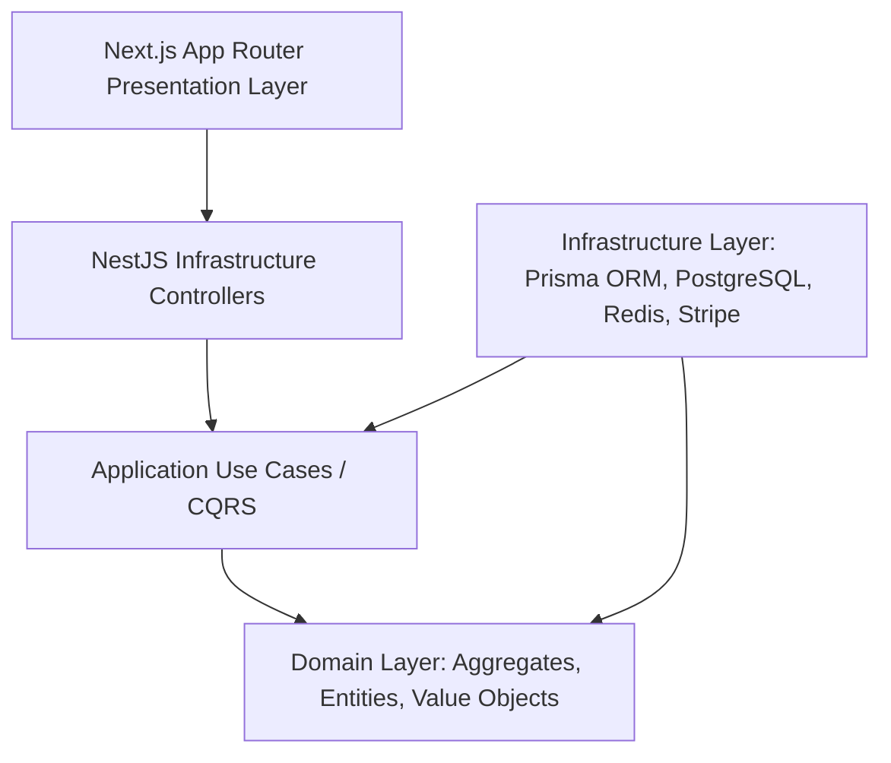

# Global CRM Architecture Blueprint - Decent Global Outsourcing (DGO)

This document establishes the enterprise-grade global architecture, coding standards, directory structures, and security patterns for the production CRM of Decent Global Outsourcing (DGO). This system is designed using a multi-tenant B2B framework to manage DGO's clients, outsourcing pipelines, contracts, resource allocations, and billing.

---

## 1. System Philosophy & High-Level Design

The DGO CRM acts as the operating system for outsourcing. It combines traditional B2B sales pipelines, contract billing systems, client onboarding portals, resource trackers, and communication timelines.

To scale reliably across millions of records and support parallel development by multiple teams, the platform enforces strict architectural boundaries:
- **Clean Architecture** (for logical separation of concerns).
- **Domain-Driven Design (DDD)** (to map software directly to real-world outsourcing operations).
- **SOLID Principles** (for code maintainability and extensibility).
- **OWASP Secure Coding Practices** (to ensure data privacy, auditability, and defense in depth).



---

## 2. Clean Architecture Blueprint

The codebase is separated into four layers, preventing business logic from bleeding into transport or database frameworks:

### 2.1 Domain Layer (Core)
The Domain layer is completely isolated. It has zero external dependencies (no NestJS, no Prisma, no third-party libraries). It contains pure typescript code defining the business models and rules.
- **Entities**: Business objects with unique identifiers and mutable states (e.g., `Lead`, `Contract`).
- **Value Objects**: Immutable attributes defined solely by their values (e.g., `Money`, `EmailAddress`).
- **Domain Events**: Dispatched when key state changes occur (e.g., `ContractSignedEvent`).
- **Domain Services**: Pure business logic that spans multiple entities (e.g., `InvoiceCalculationService`).

### 2.2 Application Layer
Coordinates the execution of business processes.
- **Use Cases / Command & Query Handlers**: Implements orchestration logic. It fetches aggregates via interfaces, executes domain logic, and saves them back.
- **Interfaces / Ports**: Inverted dependency contracts (e.g., `IUserRepository`, `IEmailService`).
- **DTOs (Data Transfer Objects)**: Strictly typed request/response payload schemas.

### 2.3 Infrastructure Layer
Contains concrete implementations of the application ports.
- **Persistence (Prisma/PostgreSQL)**: Repositories that map database rows to domain entities.
- **Identity & Security**: NestJS guards, strategies, and JWT token rotation logic.
- **External Integration Services**: Stripe billing adapters, email providers (SendGrid), and logger adapters.

### 2.4 Presentation Layer
The entry points into the application.
- **Backend Entry (NestJS Controllers)**: Maps REST routes, validates input using DTO decorators (`class-validator`), handles HTTP error mapping, and delegates execution to application handlers.
- **Frontend Entry (Next.js App Router)**: Visual interface. Employs Server Component data fetching, Client Component interactions, and client-side validation using Formik/Zod.

---

## 3. Domain-Driven Design (DDD) Patterns

DGO CRM adopts tactical DDD to build modular, self-contained packages.

### 3.1 Aggregates and Roots
Aggregates are clusters of associated objects that are treated as a single unit for data changes. Every transaction changes exactly one Aggregate.
- **Aggregate Root**: The gatekeeper of the aggregate. External objects can only hold references to the Aggregate Root.
  * *Example*: `BillingSubscription` is an aggregate root that controls nested `BillingInvoice` and `SubscriptionItem` objects.
  * *Invariant Rule*: You cannot modify a `BillingInvoice` directly; modifications must route through the `BillingSubscription` root to enforce subscription limits.

### 3.2 Repositories & Unit of Work
- **Repositories**: Standardize access to aggregates. A repository acts like an in-memory collection of aggregates. It must never leak SQL or database transactions to the Application or Domain layers.
- **Unit of Work**: Manages database transactions. When a Use Case executes, multiple repositories may change. The Unit of Work ensures that all changes succeed or fail as a atomic transaction.

---

## 4. SOLID Design Principles Implementation

To prevent the architecture from degenerating into a "spaghetti" codebase, all developers must adhere to the following definitions of SOLID:

1. **Single Responsibility Principle (SRP)**:
   - *Example*: A NestJS controller must only handle request mapping and validation. It must never calculate discounts or directly interact with the Prisma client. All business operations are delegated to Application use cases.
2. **Open-Closed Principle (OCP)**:
   - *Example*: Notification engine implements an `INotificationSender` interface. Adding Slack notifications does not require modifying existing email or SMS dispatchers. We simply register a new class implementing the interface.
3. **Liskov Substitution Principle (LSP)**:
   - *Example*: Any repository class extending `IRepository<T>` (e.g., `PrismaLeadRepository` or `MockLeadRepository` for testing) must behave identically without breaking client logic.
4. **Interface Segregation Principle (ISP)**:
   - *Example*: Rather than creating a giant `ICRMClientService` interface, split it into smaller, targeted contracts like `IClientBillingDetails`, `IClientOnboardingStatus`, and `IClientTaskAssignee`.
5. **Dependency Inversion Principle (DIP)**:
   - *Example*: High-level Application use cases depend on interfaces (e.g., `IUserRepository`), not on low-level infrastructure modules (e.g., `PrismaUserRepository`). NestJS handles dependency injection of these implementations at runtime.

---

## 5. Security & Compliance Blueprint (OWASP)

The CRM houses sensitive corporate contracts, client lists, and payroll numbers. We mitigate vulnerabilities by implementing a multi-layered security strategy:

### 5.1 Authentication (JWT + Refresh Tokens)
- **Access Tokens**: Short-lived (15 minutes), stateless JWTs stored in memory or short-lived memory state on the frontend.
- **Refresh Tokens**: Long-lived (7 days), stored in the database as a SHA-256 hash. Transmitted to the client inside an HTTP-only, secure, SameSite=Strict cookie to prevent XSS (Cross-Site Scripting) leakage.
- **Token Rotation & Replay Attack Protection**: Every time a refresh token is exchanged, a new access/refresh token pair is issued. If a client attempts to reuse an old refresh token, the system immediately revokes all refresh tokens associated with that user session, prompting a complete re-authentication.

### 5.2 Role-Based Access Control (RBAC) & Fine-Grained Permissions
We support a hierarchical RBAC matrix consisting of:
1. `SuperAdmin`: System-wide configuration, cross-tenant auditing.
2. `TenantAdmin`: Client organization owner, custom field definitions, user management.
3. `ProjectManager`: Allocation, project checklists, timesheet approvals.
4. `SalesRepresentative`: Lead and opportunity pipelines, client logs.
5. `TeamMember`: Resource allocation view, log timesheets, tasks.
6. `ClientContact`: View portal access (SLA status, tasks, invoices).

Every route is guarded by two-tier checks:
- **Role Guard**: Evaluates the user's base role class.
- **Permission Guard**: Checks for granular operations (e.g., `leads:write`, `billing:approve`).

### 5.3 Input Validation & Output Sanitization
- **Strict DTO Validation**: NestJS `ValidationPipe` running `class-validator` enforces strict rules (e.g., `@IsEmail()`, `@IsUUID()`, `@Length()`). Payload properties not explicitly defined in the DTO are automatically stripped out (`whitelist: true`, `forbidNonWhitelisted: true`).
- **SQL Injection Prevention**: Prisma ORM executes parameterized queries natively. Raw queries are banned except for optimized analytics pipelines, which must run using parameterized templates.
- **XSS & CSRF Mitigations**:
  - Helmet middleware applies strict HTTP response headers (Content-Security-Policy, X-Frame-Options: DENY, X-Content-Type-Options: nosniff).
  - CORS configurations are locked down to trusted domain names (DGO client subdomains).

---

## 6. Data Modeling & PostgreSQL Standards

The PostgreSQL database utilizes strict Third Normal Form (3NF) structures to ensure data consistency.

### 6.1 Normalization & Relational Standards
- All tables must utilize UUID v4 (`gen_random_uuid()`) primary keys to prevent record enumeration attacks and facilitate distributed multi-tenant routing.
- Foreign keys must maintain indexes to prevent cascading locks during updates.
- Constraints (`CHECK`, `UNIQUE`, `NOT NULL`) are declared natively in the database to prevent dirty write propagation.

### 6.2 Audit Logging & Soft Deletes
Every table contains standard auditable metadata fields:
- `createdAt`: TIMESTAMP WITH TIME ZONE DEFAULT NOW() NOT NULL
- `updatedAt`: TIMESTAMP WITH TIME ZONE DEFAULT NOW() NOT NULL
- `deletedAt`: TIMESTAMP WITH TIME ZONE NULL (for soft deletion support)
- `createdBy`: UUID NULL (References the user table)
- `updatedBy`: UUID NULL

### 6.3 Soft Deletion Pattern
When a record is deleted, `deletedAt` is populated. The Prisma query pipeline uses middleware/extensions to filter out records where `deletedAt` is not null by default. Hard deletes are reserved for regulatory compliance requests (e.g., GDPR right-to-be-forgotten) and restricted to SuperAdmin executions.

---

## 7. Tech Stack & Repository Structure

We structure our codebase as a modular monorepo or standard clear-split structure. Below is the directory structure for NestJS backend and Next.js frontend:

### 7.1 NestJS Directory Structure
```text
backend/
├── src/
│   ├── app.module.ts
│   ├── main.ts
│   ├── common/                # Shared decorators, exceptions, interceptors, middleware
│   │   ├── decorators/
│   │   ├── exceptions/
│   │   ├── guards/
│   │   └── pipes/
│   └── modules/               # Domain Bounded Contexts
│       ├── iam/               # Identity Access Management Module
│       │   ├── domain/        # Pure Domain Entities, Value Objects
│       │   ├── application/   # Use cases, interfaces, DTOs
│       │   ├── infrastructure/# Prisma services, strategies, token repositories
│       │   └── presentation/  # HTTP Controllers
│       ├── leads/
│       ├── accounts/
│       ├── opportunities/
│       ├── onboarding/
│       ├── billing/
│       ├── resources/
│       └── timeline/
└── prisma/
    ├── schema.prisma          # Shared database schema
    └── migrations/            # SQL migration history
```

### 7.2 Next.js Directory Structure
```text
frontend/
├── src/
│   ├── app/                   # App Router Page tree
│   │   ├── layout.tsx
│   │   ├── page.tsx
│   │   ├── dashboard/         # Authenticated layouts
│   │   │   ├── layout.tsx
│   │   │   ├── page.tsx
│   │   │   ├── leads/
│   │   │   ├── billing/
│   │   │   └── users/
│   │   └── login/             # Public routes
│   ├── components/            # Shared UI components (Atomic design)
│   │   ├── ui/                # Base components (Button, Input, Table)
│   │   ├── layout/            # Sidebar, Header, Client Portal Wrapper
│   │   └── dashboard/         # Specific dashboard charts, timeline cards
│   ├── hooks/                 # Reusable custom client side hooks
│   ├── services/              # API Client wrappers (Axios based, strict response typing)
│   └── utils/                 # Formatters, local storage helpers, date conversions
```

All subsequent modules will extend this directory structure, architectural guidelines, and database conventions to build a unified CRM product for DGO.
