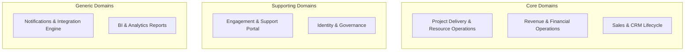
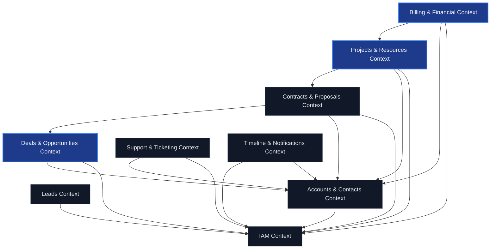
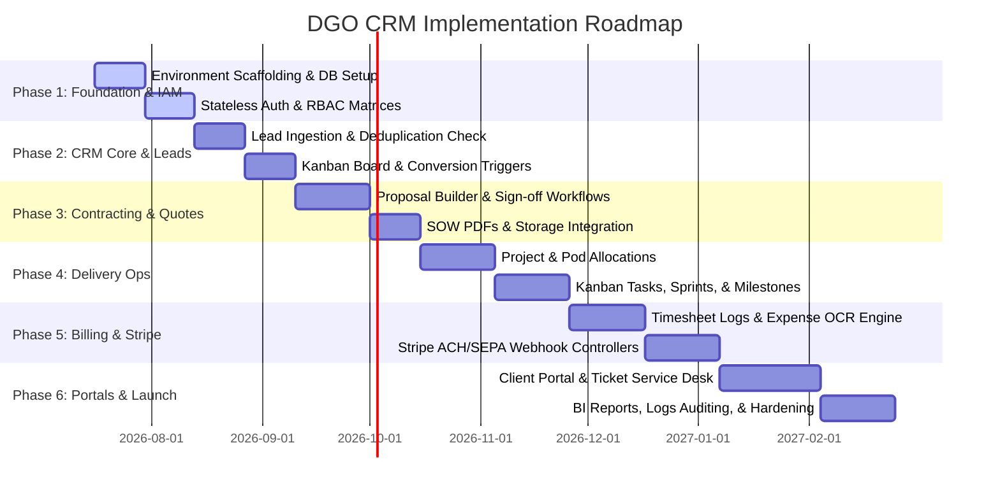
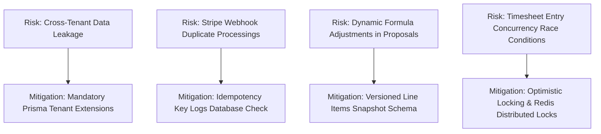

# DGO Enterprise CRM: Software Architecture Design Document

This document outlines the architectural blueprint, domain definitions, bounded contexts, system dependencies, roadmap phases, directory patterns, technical trade-offs, and risk mitigations for the production-grade SaaS CRM of **Decent Global Outsourcing (DGO)**.

---

## 1. Product & Business Model Understanding

Decent Global Outsourcing (DGO) operates as a premium global outsourcing firm. Unlike traditional B2C or simple B2B CRMs, DGO requires a specialized platform that bridges the gap between **business acquisition** (sales pipeline, quoting, contract signing) and **operational delivery** (onboarding, resource/talent allocation, pod assembly, timesheet aggregation, milestone sign-offs, billing, support).

The system acts as a multi-tenant B2B platform:
1. **Tenant Isolation**: Each client organization represents a tenant. Internal users (DGO staff: admins, sales reps, project managers, engineers) interact across multiple accounts, while external users (Client contacts) are isolated to their respective organizational workspaces (Client Portal).
2. **Operations Flow**:
   $$\text{Lead Ingestion} \rightarrow \text{Lead Qualification} \rightarrow \text{Account \& Opportunity Creation} \rightarrow \text{Proposal/Quotation Builder} \rightarrow \text{Contract (SOW) Digital Acceptance} \rightarrow$$
   $$\text{Project Scaffolding (Pods/Augmentation)} \rightarrow \text{Resource Allocation} \rightarrow \text{Milestone/Task Execution} \rightarrow \text{Timesheet Sync \& Expense Logging} \rightarrow$$
   $$\text{Invoice Generation \& Automated Stripe Billing} \rightarrow \text{Support Ticketing \& Contract Renewal}$$

---

## 2. Core Domains & Bounded Contexts

To design a scalable, maintainable codebase, we apply Domain-Driven Design (DDD) to identify **Subdomains** and establish explicit boundaries (**Bounded Contexts**).



### 2.1 Domain Definitions

1. **Sales & CRM Lifecycle (Core Domain)**: Responsible for lead ingestion, scoring, routing, opportunity forecasting, quotation composition, and contract execution.
2. **Project Delivery & Resource Operations (Core Domain)**: The execution engine. Tracks dedicated pods, staff augmentation contracts, tasks, sprints, milestone completions, and operational calendars.
3. **Revenue & Financial Operations (Core Domain)**: Governs cash flows. Handles timesheet aggregation, billing logic (hourly, retainer, fixed-price), invoice generation, Stripe payment webhooks, and expense tracking.
4. **Engagement & Support Portal (Supporting Domain)**: White-labeled interfaces for external clients, support ticketing systems, SLA managers, and digital signature wizards.
5. **Identity & Governance (Supporting Domain)**: Handles enterprise authentication, session management, RBAC matrices, hierarchical departments, and immutable compliance audit trails.
6. **BI & Reporting (Generic Domain)**: Gathers historical telemetry from sales, billing, and project deliverability to generate dashboards, forecasts, and exportable financial sheets.
7. **Notifications & Integration (Generic Domain)**: Manages real-time WebSockets, SendGrid mailers, Twilio SMS routing, and webhook ingestion safety.

---

### 2.2 Bounded Context Mapping

Within each domain, we define Bounded Contexts. Each context enforces a single, ubiquitous language and acts as an independent deployable boundary (or NestJS module).

| Bounded Context | Primary Ubiquitous Language Entities | Responsibility | Isolation Strategy |
| :--- | :--- | :--- | :--- |
| **IAM Context** | `User`, `Role`, `Permission`, `Department`, `Session`, `AuditLog` | Access governance, authentication, session revocation, and security logging. | Shared database tables, accessible to other contexts via read-only interfaces or shared token parsing guards. |
| **Sales Context** | `Lead`, `Account`, `Contact`, `Opportunity` (Deal) | Lead capturing, round-robin assignments, deduplication check, and sales funnel conversions. | Dynamic lead tables; triggers atomic database transaction to generate `Account` and `Contact` upon conversion. |
| **Quotation & Contract Context** | `Quotation`, `QuoteLineItem`, `Contract` (SOW), `Signature` | Building line-item margins, managing discount approval thresholds, digital signature flow, PDF layout versioning. | Reads `Opportunity` and `Account` context details; issues event triggers to delivery systems when contracts are activated. |
| **Project Delivery Context** | `Project`, `Milestone`, `Task`, `PodAssignment`, `Timesheet` | Scaffolding deliverables, assigning internal staff to client pods, tracking project health (SLA), logging timesheet cards. | References `Account` and `Contract` contexts. Connects timesheet logs directly to billing processors. |
| **Financial Billing Context** | `Invoice`, `InvoiceLineItem`, `Payment`, `Expense`, `Refund` | Consolidates billable hours/milestones, tracks client retainer limits, triggers dunning, generates ledgers. | Integrates with Stripe API and processes events asynchronously via idempotent webhook logs. |
| **Service Desk & Support Context** | `Ticket`, `SLAClock`, `SlaPolicy`, `Survey` | Handles client portal queries, SLA ticket timers, subject routing, and CSAT loops. | Sub-layout inside Client Portal; references `Account` and `Contact` parameters for customer lookup. |

---

## 3. Module Dependencies & Integration Flow

To ensure the architecture adheres to Clean Architecture and SOLID rules, modules are strictly decoupled. High-level orchestrators depend on abstract event contracts, avoiding circular compile-time references.



### Integration Mechanisms

1. **Synchronous Boundaries (Internal Modules)**: Controllers call Use Cases within the same module directly. Cross-context operations (e.g., `Projects` accessing `Account` parameters) occur via read-only interfaces or service queries.
2. **Asynchronous Boundaries (Domain Events)**: When an entity state change must trigger behavior in another bounded context, we dispatch a Domain Event using a **Transactional Outbox Pattern** to guarantee delivery.
   * *Example*: `OpportunityConvertedEvent` is saved in the same transaction as the opportunity update. An Outbox processor reads the event and notifies the `Projects` module to scaffold the onboarding checklist, and the `Billing` module to establish the billing account.
3. **External Systems**: Integrated through concrete adapters in the Infrastructure layer:
   * **Stripe Gateway**: For SEPA/ACH and credit card payments.
   * **Avalara API**: For dynamic sales tax computations.
   * **Supabase Storage**: For document, contract, and receipt retention.
   * **Twilio/SendGrid**: For outbound SMS and transaction alerts.

---

## 4. Suggested Folder Architecture

The CRM uses a structured monorepo format, separating NestJS (Backend API) and Next.js (Frontend UI). Both projects enforce **Clean Architecture** conventions.

### 4.1 Backend (NestJS Monorepo Structure)
Each module inside `backend/src/modules/` implements three sub-layers: `domain`, `application`, and `infrastructure` (incorporating presentation controllers).

```text
backend/
├── prisma/
│   ├── schema.prisma              # Master database schema
│   └── seed.ts                    # Production database seeding logic
├── src/
│   ├── app.module.ts              # Main entry module importing sub-modules
│   ├── main.ts                    # NestJS bootstrapping script (CORS, Helmet, Pipes)
│   ├── common/                    # Global core modules
│   │   ├── decorators/            # Custom annotations (@CurrentUser, @Permissions)
│   │   ├── exceptions/            # Custom exception filters and standard envelope formatters
│   │   ├── guards/                # RoleGuard, PermissionGuard, AuthGuard
│   │   ├── middleware/            # Request logger, trace ID injection
│   │   └── pipes/                 # Custom validation and transformer pipes
│   └── modules/                   # Bounded Context Modules
│       ├── iam/                   # Identity Access Management Module
│       │   ├── domain/            # Pure Entities (User, Role, Session), Value Objects
│       │   ├── application/       # Command/Query Handlers, DTOs, Repository interfaces
│       │   ├── infrastructure/    # Prisma repositories, bcrypt hashers, strategies
│       │   └── presentation/      # controllers (e.g., auth.controller.ts, user.controller.ts)
│       ├── leads/                 # Lead capturing, scoring, and routing rules
│       ├── accounts/              # Accounts and Contacts directory
│       ├── opportunities/         # Deal pipelines, Proposals, Quotations
│       ├── onboarding/            # Projects, Milestones, Pod Assignments, and Tasks
│       ├── billing/               # Timesheets, Invoices, Expenses, Stripe payments
│       ├── resources/             # Support tickets and SLA management
│       └── timeline/              # WebSocket triggers and multi-channel notifications
```

---

### 4.2 Frontend (Next.js 16 App Router Structure)
Utilizes the Next.js App Router. Pages are organized by context. Presentation controls are separated into shared generic components (`ui/`), workspace layouts (`layout/`), and feature-specific blocks.

```text
frontend/
├── src/
│   ├── app/                       # Page Router directory
│   │   ├── layout.tsx             # Global HTML shell, fonts, providers setup
│   │   ├── page.tsx               # Public marketing landing page
│   │   ├── (auth)/                # Public authentication routes grouping
│   │   │   ├── login/page.tsx
│   │   │   ├── mfa/page.tsx
│   │   │   └── reset-password/page.tsx
│   │   ├── (dashboard)/           # Internal authenticated workspace pages routing
│   │   │   ├── layout.tsx         # Sidebar, Global Navigation, Notification Popovers
│   │   │   ├── page.tsx           # Home workspace overview (Dashboard widgets)
│   │   │   ├── leads/             # Lead Kanban board and Detail page views
│   │   │   ├── billing/           # Invoice tables, retainer trackers, expense logs
│   │   │   ├── delivery/          # Projects, Task lists, and Gantt charts
│   │   │   └── settings/          # System configuration, API keys, User listings
│   │   └── client-portal/         # External white-labeled Client Portal
│   │       ├── layout.tsx         # Custom layout (header, portal sidebar)
│   │       ├── page.tsx           # Client home view (Project status, open invoices)
│   │       ├── invoices/          # Secure billing and Stripe payment gateways
│   │       └── tickets/           # Ticket creation form and chat timeline
│   ├── components/                # Atomic UI component directory
│   │   ├── ui/                    # Base Shadcn wrapper components (Button, Input, Popover)
│   │   ├── layout/                # Sidebar, Breadcrumb, Header, Footer
│   │   ├── delivery/              # Project charts, Task columns
│   │   └── billing/               # Invoice PDF previews, Stripe elements container
│   ├── hooks/                     # Custom hooks (e.g., useAuth, usePermission, useWebSockets)
│   ├── services/                  # TanStack Query services, Axios wrappers, API types
│   ├── store/                     # Zustand lightweight store managers (e.g., useUserStore)
│   └── utils/                     # Formatters (currency, date-fns, phone conversions)
```

---

## 5. Development Phases & Execution Roadmap

To mitigate implementation risk, DGO CRM is structured into 6 sequential, incremental delivery milestones. Each phase delivers a complete slice of the product.



### Milestone Details

1. **Phase 1: Foundation & IAM (Weeks 1-4)**: Setup NestJS/Next.js scaffolds, database schema creation, multi-tenant row routing, stateless JWT with RTR (Refresh Token Rotation), Role/Permission interceptor guards, Redis token revocations, and immutable security audit logs.
2. **Phase 2: CRM Core & Leads (Weeks 5-8)**: Capture pipeline implementation, deduplication checks (domain/email match), round-robin routing logic, lead detail view, and atomic lead conversions (Account + Contact + Opportunity creation).
3. **Phase 3: Deals, Proposals, & Contracting (Weeks 9-13)**: Deal stages, weighted opportunity forecasting widgets, dynamic quotation configurator with margin math, PDF renderer engine, and contract signature triggers via DocuSign/Adobe Sign API.
4. **Phase 4: Project Delivery & Resource Operations (Weeks 14-19)**: Transitioning won contracts into onboarding checklists, dedicated team assignment panels, collaborative task sheets, milestone gateways, and double calendar syncing (Google/Outlook).
5. **Phase 5: Financial Operations & Automated Billing (Weeks 20-25)**: Timesheet logging logs, multi-tier approvals manager, receipt image upload with OCR parsing, Avalara tax integration, Stripe ACH and credit card gateways, and idempotent webhooks.
6. **Phase 6: Client Portal & Ticket Desk (Weeks 26-32)**: Secure client workspace layout, white-labeled customizations, ticketing system with SLA timers, WebSockets real-time notifications, dashboard charts, BI exports, and SOC2 security verification checks.

---

## 6. Critical Technical Decisions & Trade-Offs

As software architects, we enforce several engineering decisions to safeguard DGO's data and provide structural reliability.

### 6.1 Multi-Tenant Data Isolation Strategy
* **Decision**: **Row-Level Shared Database Isolation** managed via Prisma Query Extensions.
* **Alternative**: Database-per-tenant or schema-per-tenant.
* **Trade-off Analysis**:
  * *Pros*: Cost-effective deployment, fast schema migrations, easy data roll-ups for multi-organization corporate structures.
  * *Cons*: Risk of cross-tenant data leakage if developers forget filter statements.
  * *Mitigation*: We implement a Prisma Client extension that automatically injects a `where: { tenantId: currentTenantId }` parameter to *every* select, update, and delete operation at the database middleware layer. Developers do not need to write tenant filters manually.

### 6.2 Token Security & Session Management
* **Decision**: **Stateless JWTs (15 min) + Rotated Database-Persisted Refresh Tokens (7 days)**.
* **Alternative**: Stateful Redis-only session records.
* **Trade-off Analysis**:
  * *Pros*: High performance, REST endpoint gateway scalability, instant token validity checks.
  * *Cons*: Cannot revoke access token before the 15-minute expiry naturally.
  * *Mitigation*: Access tokens are kept very short-lived. Refresh tokens are rotated on every request. If a refresh token is recycled, the API blocks the session instantly. For emergency lockouts, a small memory list of revoked user IDs is cached in Redis (polled during API guard checks).

### 6.3 Database Transactions & ACID Safety
* **Decision**: **Prisma Transactions (`$transaction([])`) + Transactional Outbox Pattern**.
* **Alternative**: Event-sourcing or Saga orchestrations.
* **Trade-off Analysis**:
  * *Pros*: Strong ACID guarantees for financial transactions (converting leads, allocating retainers, invoicing).
  * *Cons*: Long-running transactions lock records, potentially causing database deadlocks under heavy loads.
  * *Mitigation*: Transactions are strictly scoped to short-lived executions. Asynchronous secondary actions (like generating PDFs, sending emails, or pushing Slack alerts) are written to an `Outbox` table within the transactional boundary and handled asynchronously by a background runner.

### 6.4 Client-Side State Strategy
* **Decision**: **Zustand (Global Client State) + TanStack Query (Server State)**.
* **Alternative**: Redux Toolkit or Context API.
* **Trade-off Analysis**:
  * *Pros*: Clean separation of cached server data (managed by TanStack Query, which handles cache invalidation, polling, and auto-fetching) and local browser configuration (Zustand, which handles theme toggle, open sidebar toggles, and user token data). Lightweight footprint, minimal re-renders.
  * *Cons*: Requires developers to understand what is server state vs. local UI state.

---

## 7. Risks & Mitigation Plan

The DGO CRM contains vital corporate operational workflows. Below is our preemptive architectural risk strategy.



### Risk Details & Actions

* **R1: Cross-Tenant Data Leakage**
  * *Impact*: Critical. A client seeing another client's invoice or project info would breach SLA and legal requirements.
  * *Mitigation*: In addition to the Prisma tenant-isolation extension, the API utilizes a global NestJS interceptor that validates if the `OrganizationId` of any requested resource matches the decoded JWT `tenantId` claim before executing any application handlers.

* **R2: Stripe Webhook Redundancy**
  * *Impact*: High. Duplicate webhook payloads could cause double payments, double invoices, or incorrect dunning schedules.
  * *Mitigation*: We persist an `IntegrationWebhookLog` table storing the unique Stripe Event ID (`evt_...`). The webhook controller operates as an idempotent consumer. Before processing, it attempts to insert the event ID. If a duplicate key error is caught, the request is immediately logged as processed and returns HTTP 200 without re-running payment operations.

* **R3: Proposal Modification Errors (Historical Data Shifting)**
  * *Impact*: Medium-High. If pricing rules or discount models change, active/historical quotes could re-evaluate, changing finalized financial numbers.
  * *Mitigation*: The `QuoteLineItem` and `InvoiceLineItem` schemas do not just reference a `Product` or `PriceCard` table dynamically. During creation, the values (hourly rates, item names, discount percentages, tax amounts) are written as flat static fields inside the line item. Changes to pricing tables never mutate historic proposals or invoices.

* **R4: SLA Clock Inaccuracy**
  * *Impact*: Medium. Failure to record ticket respond time correctly could violate SLA covenants.
  * *Mitigation*: All ticket event logs are recorded utilizing UTC timestamps natively. The frontend resolves local relative display times using localized client timezones (`date-fns-tz`).
