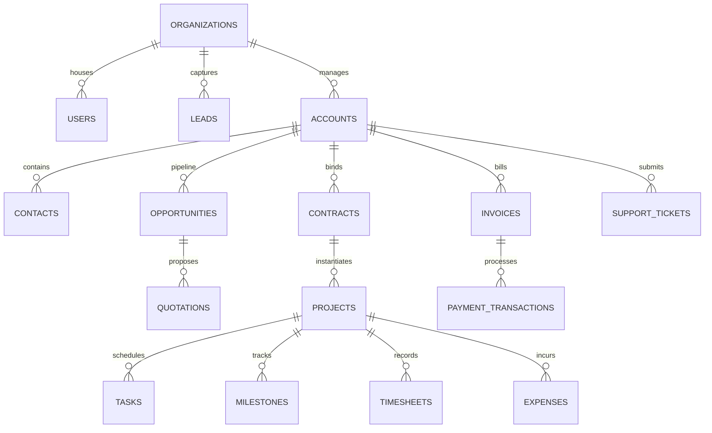

# DGO Enterprise CRM: Database Architecture & PostgreSQL Schema Design

This document details the enterprise database design for the Decent Global Outsourcing (DGO) SaaS CRM. The architecture is reviewed and designed from the perspective of a senior database architect, prioritizing structural integrity, security, multi-tenant boundaries, performance optimization, and long-term scalability.

---

## 1. Database Principles & Relational Standards

To support millions of rows, multi-tenant isolation, and strict SOC2/GDPR compliance, the database enforces the following standards:

1. **Primary Keys**: Every table uses a globally unique identifier (UUID v4) generated natively via `gen_random_uuid()` (PostgreSQL 13+ standard). This mitigates resource enumeration attacks (ID scraping) and facilitates easy database sharding or partitioning in the future.
2. **Timezone Standardization**: All datetime fields use the `TIMESTAMPTZ` (timestamp with time zone) data type. Storage is normalized to UTC, and client apps handle localized rendering.
3. **Financial Precision**: All monetary values (budgets, hourly rates, margins, transaction values) are declared as `NUMERIC(18, 4)` to eliminate floating-point rounding errors.
4. **Naming Conventions**: Use lower_snake_case for all tables, columns, indexes, and constraints.
5. **Foreign Key Integrity**: Every foreign key is explicitly declared with a matching constraint. `ON DELETE RESTRICT` is the default to prevent accidental orphaned dependencies.
6. **Connection Optimization**: Design database tables to operate under high-throughput connection pooling managed via PgBouncer.

---

## 2. Multi-Tenant Isolation Strategy (Row-Level Security)

The CRM utilizes a **Row-Level Shared Database** architecture. Every tenant-scoped table contains an `organization_id` foreign key.

```sql
ALTER TABLE any_tenant_table ENABLE ROW LEVEL SECURITY;
CREATE POLICY tenant_isolation_policy ON any_tenant_table 
    FOR ALL 
    USING (organization_id = NULLIF(current_setting('app.current_organization_id', true), '')::uuid);
```
* During request interception, NestJS sets the session's active tenant ID in the local transaction context (`app.current_organization_id`).
* PostgreSQL automatically restricts selects, updates, and deletes to rows matching the tenant context.
* Critical tables that span across tenants (such as `organizations` and `users`) are bypassed by the RLS policy and protected via application-level authentication.

---

## 3. Database Normalization & Denormalization

### 3.1 Normalization Invariants (3NF)
All operational directories (Users, Accounts, Contacts, Projects, Support Tickets) strictly conform to **Third Normal Form (3NF)**:
* Eliminates redundant data storage.
* Minimizes update anomalies (e.g., changing a contact's email modifies a single record in `contacts`, rather than repeating it across transactions).
* Enforces single-value columns and direct dependencies on primary keys.

### 3.2 Denormalization for Historic Audits (Snapshot Pattern)
To maintain financial data integrity, select contexts implement denormalization:
* **`quote_line_items` and `invoice_line_items`**: Instead of dynamically referencing hourly rates or contract pricing sheets, they capture flat snapshots of item names, tax parameters, and unit values. If a developer's base billing rate changes, historical invoices and signed proposals remain unchanged.
* **`audit_logs`**: Contains JSONB payloads storing snapshot images of records *before* and *after* modifications to prevent dependencies on deleted resource records.

---

## 4. Global Audit & Soft Delete Framework

Every table (excluding immutable logs) inherits a standardized audit block:

```sql
ALTER TABLE any_table ADD COLUMN created_at TIMESTAMPTZ NOT NULL DEFAULT CURRENT_TIMESTAMP;
ALTER TABLE any_table ADD COLUMN updated_at TIMESTAMPTZ NOT NULL DEFAULT CURRENT_TIMESTAMP;
ALTER TABLE any_table ADD COLUMN deleted_at TIMESTAMPTZ NULL;
ALTER TABLE any_table ADD COLUMN created_by_id UUID NULL REFERENCES users(id) ON DELETE SET NULL;
ALTER TABLE any_table ADD COLUMN updated_by_id UUID NULL REFERENCES users(id) ON DELETE SET NULL;
```

### 4.1 Soft Delete Implementation & Indexes
Soft deletes are handled by populating the `deleted_at` timestamp. To ensure that soft-deleted items do not conflict with active records (e.g., unique constraints on active user emails), unique constraints utilize partial indexes:

```sql
-- Allow email reuse if the historical user is soft-deleted
CREATE UNIQUE INDEX idx_users_email_active 
ON users(email) 
WHERE deleted_at IS NULL;
```

All standard select queries run through a global filter: `WHERE deleted_at IS NULL`. Hard deletes are executed only by a `SuperAdmin` for regulatory compliance (e.g., GDPR Right to Be Forgotten).

---

## 5. Entity List & Relational Schema (DDL Blueprint)



### 5.1 Identity & Governance (IAM)

#### Table: `organizations` (Tenants)
Stores organizations registered on the SaaS platform.
* `id` UUID Primary Key Default `gen_random_uuid()`
* `name` VARCHAR(255) NOT NULL
* `subdomain` VARCHAR(100) NOT NULL UNIQUE
* `status` VARCHAR(50) NOT NULL DEFAULT 'active' -- active, suspended, trial
* `created_at` TIMESTAMPTZ NOT NULL DEFAULT CURRENT_TIMESTAMP
* `updated_at` TIMESTAMPTZ NOT NULL DEFAULT CURRENT_TIMESTAMP
* `deleted_at` TIMESTAMPTZ NULL
* *Constraints*: 
  * CHECK on subdomain pattern (alphanumeric, no spaces).
  * CHECK on status values (`'active'`, `'suspended'`, `'trial'`).

#### Table: `users`
System users (internal employees and external client admins).
* `id` UUID Primary Key Default `gen_random_uuid()`
* `email` VARCHAR(255) NOT NULL
* `password_hash` VARCHAR(255) NOT NULL
* `first_name` VARCHAR(100) NOT NULL
* `last_name` VARCHAR(100) NOT NULL
* `phone` VARCHAR(50) NULL
* `mfa_secret` VARCHAR(255) NULL
* `mfa_enabled` BOOLEAN NOT NULL DEFAULT FALSE
* `status` VARCHAR(50) NOT NULL DEFAULT 'pending' -- pending, active, suspended
* `timezone` VARCHAR(100) NOT NULL DEFAULT 'UTC'
* `created_at` TIMESTAMPTZ NOT NULL
* `updated_at` TIMESTAMPTZ NOT NULL
* `deleted_at` TIMESTAMPTZ NULL
* *Indexes*:
  * Unique partial index: `idx_users_email_active` on `email` where `deleted_at IS NULL`.

#### Table: `roles`
* `id` UUID Primary Key
* `name` VARCHAR(100) NOT NULL UNIQUE
* `description` TEXT NULL

#### Table: `permissions`
* `id` UUID Primary Key
* `code` VARCHAR(100) NOT NULL UNIQUE -- e.g., 'leads:write', 'billing:approve'
* `description` TEXT NULL

#### Table: `role_permissions`
Many-to-many join table resolving role capabilities.
* `role_id` UUID NOT NULL REFERENCES roles(id) ON DELETE CASCADE
* `permission_id` UUID NOT NULL REFERENCES permissions(id) ON DELETE CASCADE
* *Constraints*: Primary Key composed of `(role_id, permission_id)`.

#### Table: `user_organizations`
Maps users to organizations with a primary role classification.
* `user_id` UUID NOT NULL REFERENCES users(id) ON DELETE CASCADE
* `organization_id` UUID NOT NULL REFERENCES organizations(id) ON DELETE CASCADE
* `role_id` UUID NOT NULL REFERENCES roles(id) ON DELETE RESTRICT
* *Constraints*: Primary Key composed of `(user_id, organization_id)`.

#### Table: `user_sessions`
Active browser authentication logins. Used for Refresh Token Rotation and revocation.
* `id` UUID Primary Key
* `user_id` UUID NOT NULL REFERENCES users(id) ON DELETE CASCADE
* `token_family_id` UUID NOT NULL -- groups rotated token requests
* `refresh_token_hash` VARCHAR(255) NOT NULL UNIQUE
* `ip_address` VARCHAR(45) NULL -- supports IPv6
* `user_agent` TEXT NULL
* `expires_at` TIMESTAMPTZ NOT NULL
* `is_revoked` BOOLEAN NOT NULL DEFAULT FALSE
* `created_at` TIMESTAMPTZ NOT NULL

#### Table: `audit_logs` (Immutable Log)
Cryptographic record of authorization and configuration events.
* `id` UUID Primary Key
* `organization_id` UUID NULL REFERENCES organizations(id) ON DELETE SET NULL
* `user_id` UUID NULL REFERENCES users(id) ON DELETE SET NULL
* `action` VARCHAR(100) NOT NULL -- e.g., 'auth.login', 'user.update'
* `resource_name` VARCHAR(100) NOT NULL -- e.g., 'billing', 'leads'
* `resource_id` UUID NULL
* `payload_before` JSONB NULL -- record state before modification
* `payload_after` JSONB NULL -- record state after modification
* `ip_address` VARCHAR(45) NULL
* `created_at` TIMESTAMPTZ NOT NULL DEFAULT CURRENT_TIMESTAMP
* *Indexes*:
  * B-tree index on `organization_id`.
  * Index on `(resource_name, resource_id)`.
  * GiST index on `payload_after` for JSON schema searches.

---

### 5.2 Lead & Pipeline Management

#### Table: `leads`
* `id` UUID Primary Key
* `organization_id` UUID NOT NULL REFERENCES organizations(id) ON DELETE CASCADE
* `owner_id` UUID NULL REFERENCES users(id) ON DELETE SET NULL
* `first_name` VARCHAR(100) NOT NULL
* `last_name` VARCHAR(100) NOT NULL
* `email` VARCHAR(255) NOT NULL
* `phone` VARCHAR(50) NULL
* `company_name` VARCHAR(255) NOT NULL
* `website` VARCHAR(255) NULL
* `source` VARCHAR(100) NOT NULL -- e.g. 'website', 'cold_call', 'referral'
* `status` VARCHAR(50) NOT NULL DEFAULT 'new' -- new, contacted, qualified, nurturing, unqualified, converted
* `score` INT NOT NULL DEFAULT 0
* `budget` NUMERIC(18, 4) NULL
* `converted_at` TIMESTAMPTZ NULL
* `converted_account_id` UUID NULL
* `converted_contact_id` UUID NULL
* `converted_opportunity_id` UUID NULL
* `created_at` TIMESTAMPTZ NOT NULL
* `updated_at` TIMESTAMPTZ NOT NULL
* `deleted_at` TIMESTAMPTZ NULL
* *Constraints*:
  * CHECK on `budget >= 0`.
  * CHECK on status values.
* *Indexes*:
  * B-tree index on `email` and `company_name` to speed up deduplication scans.

---

### 5.3 Accounts, Contacts & Opportunities

#### Table: `accounts` (Clients)
Corporate client records. Supports hierarchical parent-subsidiary mapping.
* `id` UUID Primary Key
* `organization_id` UUID NOT NULL REFERENCES organizations(id) ON DELETE CASCADE
* `parent_id` UUID NULL REFERENCES accounts(id) ON DELETE SET NULL -- subsidiary link
* `name` VARCHAR(255) NOT NULL
* `industry` VARCHAR(100) NULL
* `employee_count` INT NULL
* `annual_revenue` NUMERIC(18, 4) NULL
* `status` VARCHAR(50) NOT NULL DEFAULT 'active' -- active, inactive
* `created_at` TIMESTAMPTZ NOT NULL
* `updated_at` TIMESTAMPTZ NOT NULL
* `deleted_at` TIMESTAMPTZ NULL
* *Indexes*:
  * B-tree index on `parent_id` for recursive query evaluations.

#### Table: `contacts`
* `id` UUID Primary Key
* `organization_id` UUID NOT NULL REFERENCES organizations(id) ON DELETE CASCADE
* `account_id` UUID NOT NULL REFERENCES accounts(id) ON DELETE CASCADE
* `first_name` VARCHAR(100) NOT NULL
* `last_name` VARCHAR(100) NOT NULL
* `email` VARCHAR(255) NOT NULL
* `phone` VARCHAR(50) NULL
* `is_primary` BOOLEAN NOT NULL DEFAULT FALSE
* `gdpr_opt_in` BOOLEAN NOT NULL DEFAULT FALSE
* `created_at` TIMESTAMPTZ NOT NULL
* `updated_at` TIMESTAMPTZ NOT NULL
* `deleted_at` TIMESTAMPTZ NULL
* *Constraints*:
  * Partial unique index for one primary contact per account:
    `CREATE UNIQUE INDEX idx_primary_contact ON contacts(account_id) WHERE is_primary = TRUE AND deleted_at IS NULL;`

#### Table: `opportunities` (Deals)
Sales opportunities.
* `id` UUID Primary Key
* `organization_id` UUID NOT NULL REFERENCES organizations(id) ON DELETE CASCADE
* `account_id` UUID NOT NULL REFERENCES accounts(id) ON DELETE CASCADE
* `owner_id` UUID NULL REFERENCES users(id) ON DELETE SET NULL
* `name` VARCHAR(255) NOT NULL
* `stage` VARCHAR(50) NOT NULL DEFAULT 'discovery' -- discovery, proposal, negotiation, closed_won, closed_lost
* `value` NUMERIC(18, 4) NOT NULL
* `probability` INT NOT NULL DEFAULT 10 -- percentage value
* `weighted_value` NUMERIC(18, 4) GENERATED ALWAYS AS (value * probability / 100) STORED
* `close_date` DATE NOT NULL
* `created_at` TIMESTAMPTZ NOT NULL
* `updated_at` TIMESTAMPTZ NOT NULL
* `deleted_at` TIMESTAMPTZ NULL
* *Constraints*:
  * CHECK on probability values: `CHECK (probability BETWEEN 0 AND 100)`.
  * CHECK on value: `CHECK (value >= 0)`.

#### Table: `quotations`
Proposals built and sent to clients.
* `id` UUID Primary Key
* `organization_id` UUID NOT NULL REFERENCES organizations(id) ON DELETE CASCADE
* `opportunity_id` UUID NOT NULL REFERENCES opportunities(id) ON DELETE CASCADE
* `version` INT NOT NULL DEFAULT 1
* `discount_percentage` NUMERIC(5, 2) NOT NULL DEFAULT 0.00
* `tax_percentage` NUMERIC(5, 2) NOT NULL DEFAULT 0.00
* `subtotal` NUMERIC(18, 4) NOT NULL DEFAULT 0.00
* `total` NUMERIC(18, 4) NOT NULL DEFAULT 0.00
* `status` VARCHAR(50) NOT NULL DEFAULT 'draft' -- draft, sent, approved, expired
* `expires_at` DATE NOT NULL
* `created_at` TIMESTAMPTZ NOT NULL
* `updated_at` TIMESTAMPTZ NOT NULL
* `deleted_at` TIMESTAMPTZ NULL

#### Table: `quote_line_items` (Snapshot Table)
* `id` UUID Primary Key
* `quotation_id` UUID NOT NULL REFERENCES quotations(id) ON DELETE CASCADE
* `item_name` VARCHAR(255) NOT NULL -- snapshotted product name
* `description` TEXT NULL
* `quantity` INT NOT NULL
* `unit_price` NUMERIC(18, 4) NOT NULL -- snapshotted unit rate
* `subtotal` NUMERIC(18, 4) GENERATED ALWAYS AS (quantity * unit_price) STORED
* *Constraints*:
  * CHECK quantity `CHECK (quantity > 0)`.

---

### 5.4 Projects, Tasks & Onboarding

#### Table: `contracts` (SOW)
Exposes active legally binding parameters triggered from won opportunities.
* `id` UUID Primary Key
* `organization_id` UUID NOT NULL REFERENCES organizations(id) ON DELETE CASCADE
* `account_id` UUID NOT NULL REFERENCES accounts(id) ON DELETE CASCADE
* `opportunity_id` UUID NULL REFERENCES opportunities(id) ON DELETE SET NULL
* `signed_quotation_id` UUID NULL REFERENCES quotations(id) ON DELETE SET NULL
* `title` VARCHAR(255) NOT NULL
* `document_url` VARCHAR(512) NOT NULL
* `status` VARCHAR(50) NOT NULL DEFAULT 'draft' -- draft, signed, expired, terminated
* `start_date` DATE NOT NULL
* `end_date` DATE NOT NULL
* `created_at` TIMESTAMPTZ NOT NULL
* `updated_at` TIMESTAMPTZ NOT NULL
* `deleted_at` TIMESTAMPTZ NULL

#### Table: `projects`
Delivery operations pod framework.
* `id` UUID Primary Key
* `organization_id` UUID NOT NULL REFERENCES organizations(id) ON DELETE CASCADE
* `account_id` UUID NOT NULL REFERENCES accounts(id) ON DELETE CASCADE
* `contract_id` UUID NOT NULL REFERENCES contracts(id) ON DELETE RESTRICT
* `name` VARCHAR(255) NOT NULL
* `delivery_type` VARCHAR(50) NOT NULL -- pod, staff_aug, fixed_milestone
* `status` VARCHAR(50) NOT NULL DEFAULT 'onboarding' -- onboarding, active, paused, completed
* `created_at` TIMESTAMPTZ NOT NULL
* `updated_at` TIMESTAMPTZ NOT NULL
* `deleted_at` TIMESTAMPTZ NULL

#### Table: `project_milestones`
Billing gates for fixed-price agreements or delivery phase markers.
* `id` UUID Primary Key
* `project_id` UUID NOT NULL REFERENCES projects(id) ON DELETE CASCADE
* `name` VARCHAR(255) NOT NULL
* `due_date` DATE NOT NULL
* `value` NUMERIC(18, 4) NULL -- revenue recognition trigger amount
* `status` VARCHAR(50) NOT NULL DEFAULT 'pending' -- pending, approved, delayed
* `sign_off_signature_url` VARCHAR(512) NULL -- proof of client approval
* `created_at` TIMESTAMPTZ NOT NULL
* `updated_at` TIMESTAMPTZ NOT NULL
* `deleted_at` TIMESTAMPTZ NULL

#### Table: `project_allocations`
Maps internal engineers to client delivery pods.
* `id` UUID Primary Key
* `project_id` UUID NOT NULL REFERENCES projects(id) ON DELETE CASCADE
* `user_id` UUID NOT NULL REFERENCES users(id) ON DELETE CASCADE
* `allocation_percentage` INT NOT NULL DEFAULT 100 -- bandwidth check
* `billable_rate_hourly` NUMERIC(18, 4) NOT NULL
* `start_date` DATE NOT NULL
* `end_date` DATE NULL
* `created_at` TIMESTAMPTZ NOT NULL
* `updated_at` TIMESTAMPTZ NOT NULL
* *Constraints*:
  * CHECK value limits: `CHECK (allocation_percentage BETWEEN 1 AND 100)`.

#### Table: `tasks`
* `id` UUID Primary Key
* `project_id` UUID NOT NULL REFERENCES projects(id) ON DELETE CASCADE
* `assignee_id` UUID NULL REFERENCES users(id) ON DELETE SET NULL
* `title` VARCHAR(255) NOT NULL
* `description` TEXT NULL
* `status` VARCHAR(50) NOT NULL DEFAULT 'todo' -- todo, in_progress, review, done
* `priority` VARCHAR(20) NOT NULL DEFAULT 'medium' -- low, medium, high, urgent
* `estimated_hours` NUMERIC(6, 2) NULL
* `due_date` DATE NULL
* `created_at` TIMESTAMPTZ NOT NULL
* `updated_at` TIMESTAMPTZ NOT NULL
* `deleted_at` TIMESTAMPTZ NULL

#### Table: `task_dependencies`
Ensures that blocker hierarchies are enforced.
* `task_id` UUID NOT NULL REFERENCES tasks(id) ON DELETE CASCADE
* `blocked_by_task_id` UUID NOT NULL REFERENCES tasks(id) ON DELETE CASCADE
* *Constraints*:
  * Primary Key: `(task_id, blocked_by_task_id)`.
  * Prevent circular reference: Must write trigger checking recursive hierarchy before insert.

---

### 5.5 Timesheets, Expenses & Invoices

#### Table: `timesheets`
Operational records of engineering hours.
* `id` UUID Primary Key
* `organization_id` UUID NOT NULL REFERENCES organizations(id) ON DELETE CASCADE
* `project_id` UUID NOT NULL REFERENCES projects(id) ON DELETE CASCADE
* `user_id` UUID NOT NULL REFERENCES users(id) ON DELETE CASCADE
* `task_id` UUID NULL REFERENCES tasks(id) ON DELETE SET NULL
* `hours` NUMERIC(5, 2) NOT NULL
* `date` DATE NOT NULL
* `description` TEXT NOT NULL
* `status` VARCHAR(50) NOT NULL DEFAULT 'submitted' -- submitted, approved, rejected
* `approved_by_id` UUID NULL REFERENCES users(id) ON DELETE SET NULL
* `invoice_id` UUID NULL -- populated when billed
* `created_at` TIMESTAMPTZ NOT NULL
* `updated_at` TIMESTAMPTZ NOT NULL
* `deleted_at` TIMESTAMPTZ NULL
* *Constraints*:
  * CHECK limits: `CHECK (hours > 0 AND hours <= 24)`.

#### Table: `expenses`
Operational expenses incurred.
* `id` UUID Primary Key
* `organization_id` UUID NOT NULL REFERENCES organizations(id) ON DELETE CASCADE
* `project_id` UUID NOT NULL REFERENCES projects(id) ON DELETE CASCADE
* `user_id` UUID NOT NULL REFERENCES users(id) ON DELETE CASCADE
* `amount` NUMERIC(18, 4) NOT NULL
* `currency` VARCHAR(10) NOT NULL DEFAULT 'USD'
* `category` VARCHAR(100) NOT NULL -- travel, software, hardware, office
* `receipt_url` VARCHAR(512) NOT NULL
* `ocr_payload` JSONB NULL -- output from receipt processing
* `billable` BOOLEAN NOT NULL DEFAULT TRUE
* `status` VARCHAR(50) NOT NULL DEFAULT 'pending' -- pending, approved, rejected, reimbursed
* `approved_by_id` UUID NULL REFERENCES users(id) ON DELETE SET NULL
* `invoice_id` UUID NULL REFERENCES invoices(id) ON DELETE SET NULL
* `created_at` TIMESTAMPTZ NOT NULL
* `updated_at` TIMESTAMPTZ NOT NULL
* `deleted_at` TIMESTAMPTZ NULL

#### Table: `invoices`
Billing items sent to clients.
* `id` UUID Primary Key
* `organization_id` UUID NOT NULL REFERENCES organizations(id) ON DELETE CASCADE
* `account_id` UUID NOT NULL REFERENCES accounts(id) ON DELETE CASCADE
* `invoice_number` VARCHAR(100) NOT NULL -- unique per tenant
* `subtotal` NUMERIC(18, 4) NOT NULL
* `tax_amount` NUMERIC(18, 4) NOT NULL
* `total` NUMERIC(18, 4) NOT NULL
* `currency` VARCHAR(10) NOT NULL DEFAULT 'USD'
* `status` VARCHAR(50) NOT NULL DEFAULT 'draft' -- draft, open, paid, void, uncollectible
* `due_date` DATE NOT NULL
* `paid_at` TIMESTAMPTZ NULL
* `stripe_invoice_id` VARCHAR(255) NULL
* `created_at` TIMESTAMPTZ NOT NULL
* `updated_at` TIMESTAMPTZ NOT NULL
* `deleted_at` TIMESTAMPTZ NULL
* *Constraints*:
  * Unique invoice number within organization:
    `CREATE UNIQUE INDEX idx_invoice_number_tenant ON invoices(organization_id, invoice_number) WHERE deleted_at IS NULL;`

#### Table: `invoice_line_items` (Snapshot Table)
* `id` UUID Primary Key
* `invoice_id` UUID NOT NULL REFERENCES invoices(id) ON DELETE CASCADE
* `item_name` VARCHAR(255) NOT NULL
* `description` TEXT NULL
* `quantity` NUMERIC(10, 2) NOT NULL
* `unit_price` NUMERIC(18, 4) NOT NULL
* `amount` NUMERIC(18, 4) GENERATED ALWAYS AS (quantity * unit_price) STORED
* `timesheet_id` UUID NULL REFERENCES timesheets(id) ON DELETE SET NULL
* `expense_id` UUID NULL REFERENCES expenses(id) ON DELETE SET NULL

#### Table: `payment_transactions`
Payment gateway transactions logs.
* `id` UUID Primary Key
* `organization_id` UUID NOT NULL REFERENCES organizations(id) ON DELETE CASCADE
* `invoice_id` UUID NOT NULL REFERENCES invoices(id) ON DELETE RESTRICT
* `stripe_charge_id` VARCHAR(255) NOT NULL UNIQUE
* `amount` NUMERIC(18, 4) NOT NULL
* `status` VARCHAR(50) NOT NULL -- succeeded, pending, failed, refunded
* `payment_method` VARCHAR(50) NOT NULL -- credit_card, ach, sepa
* `failure_reason` TEXT NULL
* `created_at` TIMESTAMPTZ NOT NULL

#### Table: `integration_webhook_logs` (Idempotence Guard Table)
* `id` VARCHAR(255) Primary Key -- Stores Stripe's `evt_...` ID
* `source` VARCHAR(100) NOT NULL -- e.g., 'stripe'
* `processed_at` TIMESTAMPTZ NOT NULL DEFAULT CURRENT_TIMESTAMP

---

### 5.6 Support & Service Desk

#### Table: `support_tickets`
* `id` UUID Primary Key
* `organization_id` UUID NOT NULL REFERENCES organizations(id) ON DELETE CASCADE
* `account_id` UUID NOT NULL REFERENCES accounts(id) ON DELETE CASCADE
* `contact_id` UUID NULL REFERENCES contacts(id) ON DELETE SET NULL
* `assignee_id` UUID NULL REFERENCES users(id) ON DELETE SET NULL
* `subject` VARCHAR(255) NOT NULL
* `status` VARCHAR(50) NOT NULL DEFAULT 'open' -- open, in_progress, pending_client, resolved, closed
* `priority` VARCHAR(20) NOT NULL DEFAULT 'medium' -- low, medium, high, urgent
* `sla_response_due_at` TIMESTAMPTZ NOT NULL
* `sla_resolution_due_at` TIMESTAMPTZ NOT NULL
* `created_at` TIMESTAMPTZ NOT NULL
* `updated_at` TIMESTAMPTZ NOT NULL
* `deleted_at` TIMESTAMPTZ NULL

#### Table: `ticket_messages`
Chat log within support tickets.
* `id` UUID Primary Key
* `ticket_id` UUID NOT NULL REFERENCES support_tickets(id) ON DELETE CASCADE
* `sender_id` UUID NOT NULL REFERENCES users(id) ON DELETE CASCADE -- can be client or agent
* `message_body` TEXT NOT NULL
* `attachments_urls` VARCHAR(512)[] NULL -- array of storage paths
* `created_at` TIMESTAMPTZ NOT NULL

---

## 6. Table Indexing & Query Optimizations

To maintain sub-100ms API queries, we apply the following indexes:

### 6.1 Foreign Key Index Enforcement
Every foreign key field has a B-tree index. This prevents sequential scans on joins and cascades when updating relations.
* `CREATE INDEX idx_contacts_account_id ON contacts(account_id);`
* `CREATE INDEX idx_opportunities_account_id ON opportunities(account_id);`
* `CREATE INDEX idx_tasks_project_id ON tasks(project_id);`
* `CREATE INDEX idx_timesheets_user_id ON timesheets(user_id);`

### 6.2 Partial Performance Indexes
Used to isolate active workflow items from historically soft-deleted items.
* **Active Support Tickets**:
  `CREATE INDEX idx_active_tickets ON support_tickets(organization_id, assignee_id) WHERE status != 'closed' AND deleted_at IS NULL;`
* **Active Tasks**:
  `CREATE INDEX idx_tasks_status ON tasks(project_id, status) WHERE deleted_at IS NULL;`
* **Uninvoiced Timesheets**:
  `CREATE INDEX idx_uninvoiced_timesheets ON timesheets(project_id) WHERE invoice_id IS NULL AND status = 'approved' AND deleted_at IS NULL;`

### 6.3 Text Search Vector Optimization (GIN Indexes)
To support fast searching of contacts, leads, and accounts without table-scans:
* `CREATE INDEX idx_leads_search_name ON leads USING gin(to_tsvector('english', first_name || ' ' || last_name || ' ' || company_name));`

---

## 7. Database Integrity & Check Constraints

We establish hard constraints in the schema to ensure that database logic acts as the final line of defense against corrupted data:

1. **Email RFC Validation Check**:
   ```sql
   ALTER TABLE users ADD CONSTRAINT chk_users_email_format 
   CHECK (email ~* '^[A-Za-z0-9._%-]+@[A-Za-z0-9.-]+\.[A-Za-z]{2,4}$');
   ```
2. **Value Lower Bounds**:
   * `ALTER TABLE quote_line_items ADD CONSTRAINT chk_line_quantity CHECK (quantity > 0);`
   * `ALTER TABLE opportunities ADD CONSTRAINT chk_deal_value CHECK (value >= 0.0000);`
3. **Timeline Chronology Checks**:
   * `ALTER TABLE contracts ADD CONSTRAINT chk_contract_dates CHECK (end_date >= start_date);`
   * `ALTER TABLE project_allocations ADD CONSTRAINT chk_allocation_dates CHECK (end_date IS NULL OR end_date >= start_date);`
4. **String Value Enums Check**:
   * `ALTER TABLE leads ADD CONSTRAINT chk_lead_status CHECK (status IN ('new', 'contacted', 'qualified', 'nurturing', 'unqualified', 'converted'));`

---

## 8. Future Scalability Blueprint

To prepare the CRM for hosting tens of thousands of active tenants and millions of timesheet cards, we outline three scaling layers:

### 8.1 Partitioning Large Tables
Three tables will expand exponentially: `audit_logs`, `timesheets`, and `ticket_messages`. We enforce range partitioning on the `created_at` timestamp.

* **Audit Logs Partition Schema**:
  ```sql
  CREATE TABLE audit_logs (
      id UUID NOT NULL,
      organization_id UUID,
      action VARCHAR(100) NOT NULL,
      created_at TIMESTAMPTZ NOT NULL,
      -- other fields
      PRIMARY KEY (id, created_at)
  ) PARTITION BY RANGE (created_at);
  ```
  * A background cron worker automatically builds the partition tables monthly (e.g., `audit_logs_y2026m07` for July 2026).
  * Old historical partitions (older than 1 year) are converted into CSV archives and loaded into cold cloud storage (S3 Glacier), freeing active memory space.

### 8.2 Citus/Sharding Path
If database storage exceeds active disk limitations on a single relational cluster, DGO CRM is structured to support distributed scaling via **Citus (PostgreSQL Extension)**.
* **Distribution Column**: Every tenant-facing table contains `organization_id`. 
* **Sharding Execution**: Citus hashes `organization_id` to route all queries from Tenant X to a specific database worker node. Because all joins (`organizations`, `accounts`, `projects`, `tasks`, `invoices`) utilize the same `organization_id` context key, queries join locally on the worker nodes without network hopping.

### 8.3 Cache Offloading (Redis Read-Caches)
To reduce CPU load on PostgreSQL:
* **Session Cache**: Active JWT session configurations and RBAC user permissions are cached in Redis. NestJS validates authentication details against Redis keys, eliminating user-lookup DB query overhead on every API request.
* **Dashboard Cache**: Analytical metrics (ARR, MRR, active SLA counters) are computed asynchronously by a cron script, cached in Redis, and updated every 15 minutes, bypassing Postgres for the main dashboard render.
