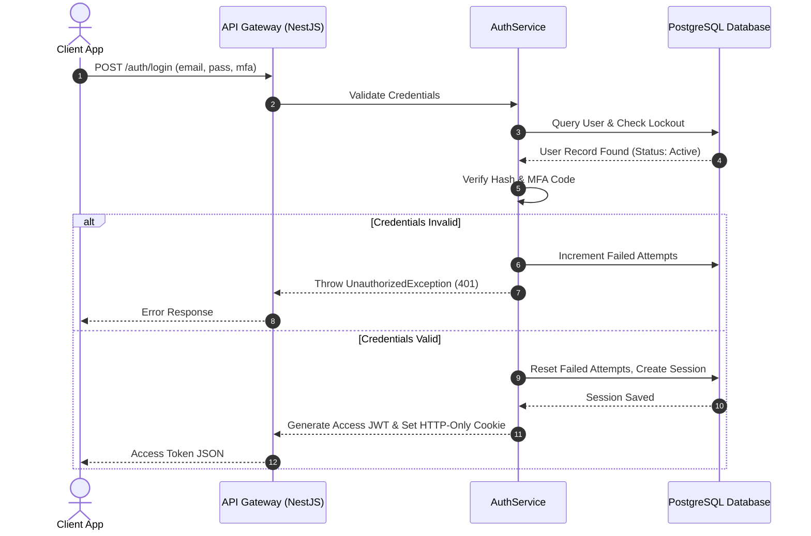

# Module 1: Identity & Access Management (IAM & RBAC)

This document details the architecture, design, and implementation specifications for the Identity & Access Management (IAM) and Role-Based Access Control (RBAC) module of the Decent Global Outsourcing (DGO) CRM.

---

## 1. Problem Statement
DGO operates as a global multi-tenant outsourcing company handling sensitive client communications, operational timesheets, IP protected project codebases, and financial contracts. The current access controls are siloed, prone to session hijack, and lack granular auditing. To prevent data leakage and provide clients, vendors, and internal employees with secure, isolated interfaces, a unified enterprise IAM is required.

## 2. Objectives
- Establish secure, multi-tenant authentication using JWT Access Tokens and database-persisted rotated Refresh Tokens.
- Implement hierarchical Role-Based Access Control (RBAC) with granular functional permissions.
- Provide a cryptographic Audit Trail of all security actions (login, logout, token refresh, password resets, permission changes).
- Enforce strict security validation adhering to OWASP rules (rate limiting, strong password requirements, CSRF/XSS protection).

## 3. Functional Requirements
- **Tenant Isolation**: Users belong to one or more Organizations (tenants). All queries must filter by tenant context.
- **User Authentication**: Sign-up, email verification, multi-factor login (TOTP/SMS), password reset, and logout.
- **Token Refresh**: Token exchange endpoint utilizing Refresh Token rotation to maintain continuous sessions securely.
- **RBAC Configuration**: Admins can assign roles to users and define permission matrices dynamically or via seed records.
- **Session Management**: Users can list, audit, and force-terminate active login sessions from different devices.

## 4. Non-Functional Requirements
- **Security**: Access token expiry must be exactly 15 minutes; Refresh Token expiry must be 7 days.
- **Performance**: Password hashing must use `bcrypt` with a cost factor of 12. Token validation overhead must be < 5ms (in-memory caching of permissions via Redis).
- **Scalability**: Stateless access tokens to support horizontal scaling of NestJS API gateways.
- **Availability**: Zero-downtime authentication service; Redis-backed cache replication for token revocation list.

## 5. Business Rules
- **BR1**: Passwords must contain at least 12 characters, including 1 uppercase, 1 lowercase, 1 number, and 1 special character.
- **BR2**: A user account is locked for 30 minutes after 5 consecutive failed login attempts.
- **BR3**: Refresh tokens can only be used once. If a refresh token is reused, the entire token family is revoked immediately (Replay Attack Prevention).
- **BR4**: Standard users cannot elevate their own roles or permission sets. Only TenantAdmin or SuperAdmin can modify roles.

## 6. User Stories
- **US1.1**: *As a Sales Agent*, I want to log in securely with multi-factor authentication so that client lists remain confidential.
- **US1.2**: *As a Client Contact*, I want to access my portal using a direct invitation link so that I can securely review contract invoicing.
- **US1.3**: *As an IT Auditor*, I want to see a detailed log of all failed login attempts and privilege modifications to ensure compliance with SOC2.

## 7. Acceptance Criteria
- **AC1**: System must block passwords found in the top 100,000 common password blacklist.
- **AC2**: Upon login, the client receives the Access Token in the JSON body and the Refresh Token in a `Set-Cookie` header (`HttpOnly`, `Secure`, `SameSite=Strict`).
- **AC3**: Any attempt to modify a user's role must create an immediate audit log entry containing the modifier's ID, Target User ID, old roles, new roles, and IP Address.

## 8. UI Flow
```text
[Landing Page] 
       │
       ▼
   [Login Form] ──(Validates input via frontend validation)
       │
       ├─► (MFA Enabled?) ──► [TOTP Input screen]
       │
       ▼
[Dashboard Workspace] ◄──(Saves JWT in memory, starts silent refresh timer)
```

## 9. Navigation
- `/login`: Public access page.
- `/dashboard/settings/security`: Session monitoring, password resets, MFA config.
- `/dashboard/admin/users`: Role assignments and tenant user management (TenantAdmin only).
- `/dashboard/admin/roles`: Granular permission matrix settings.

## 10. Wireframe Description
The login screen is clean and centered, utilizing Outfit typography and glassmorphic panels. It contains:
- **Tenant Context Selector / Login ID field**: Email address input.
- **Password Input**: With toggleable visibility icon.
- **Submit Button**: With loading spinner micro-animations.
- **MFA Challenge Overlay**: Replaces the login card when TOTP is active, requesting a 6-digit numeric field.

## 11. Database Schema
Below is the PostgreSQL schema represented in Prisma ORM format:

```prisma
model Organization {
  id        String   @id @default(dbgenerated("gen_random_uuid()")) @db.Uuid
  name      String   @db.VarChar(255)
  slug      String   @unique @db.VarChar(255)
  createdAt DateTime @default(now()) @db.Timestamptz(6)
  updatedAt DateTime @updatedAt @db.Timestamptz(6)
  users     User[]
  roles     Role[]
}

model User {
  id             String          @id @default(dbgenerated("gen_random_uuid()")) @db.Uuid
  organizationId String          @db.Uuid
  email          String          @db.VarChar(255)
  passwordHash   String          @db.VarChar(255)
  fullName       String          @db.VarChar(255)
  isMfaActive    Boolean         @default(false)
  mfaSecret      String?         @db.VarChar(255)
  status         UserStatus      @default(PENDING)
  failedAttempts Int             @default(0)
  lockoutUntil   DateTime?       @db.Timestamptz(6)
  createdAt      DateTime        @default(now()) @db.Timestamptz(6)
  updatedAt      DateTime        @updatedAt @db.Timestamptz(6)
  deletedAt      DateTime?       @db.Timestamptz(6)
  
  organization   Organization    @relation(fields: [organizationId], references: [id])
  sessions       UserSession[]
  roles          UserRole[]
  auditLogs      AuditLog[]

  @@unique([organizationId, email])
  @@index([organizationId])
}

enum UserStatus {
  PENDING
  ACTIVE
  SUSPENDED
}

model Role {
  id             String           @id @default(dbgenerated("gen_random_uuid()")) @db.Uuid
  organizationId String           @db.Uuid
  name           String           @db.VarChar(100)
  description    String?          @db.VarChar(255)
  createdAt      DateTime         @default(now()) @db.Timestamptz(6)
  
  organization   Organization     @relation(fields: [organizationId], references: [id])
  permissions    RolePermission[]
  users          UserRole[]

  @@unique([organizationId, name])
}

model Permission {
  id          String           @id @default(dbgenerated("gen_random_uuid()")) @db.Uuid
  action      String           @unique @db.VarChar(100) // e.g. "leads:write"
  description String?          @db.VarChar(255)
  roles       RolePermission[]
}

model RolePermission {
  roleId       String     @db.Uuid
  permissionId String     @db.Uuid
  role         Role       @relation(fields: [roleId], references: [id], onDelete: Cascade)
  permission   Permission @relation(fields: [permissionId], references: [id], onDelete: Cascade)

  @@id([roleId, permissionId])
}

model UserRole {
  userId String @db.Uuid
  roleId String @db.Uuid
  user   User   @relation(fields: [userId], references: [id], onDelete: Cascade)
  role   Role   @relation(fields: [roleId], references: [id], onDelete: Cascade)

  @@id([userId, roleId])
}

model UserSession {
  id           String   @id @default(dbgenerated("gen_random_uuid()")) @db.Uuid
  userId       String   @db.Uuid
  tokenFamily  String   @db.Uuid
  refreshToken String   @unique @db.VarChar(512) // SHA-256 hash of refresh token
  ipAddress    String   @db.VarChar(45)
  userAgent    String   @db.VarChar(255)
  expiresAt    DateTime @db.Timestamptz(6)
  isRevoked    Boolean  @default(false)
  createdAt    DateTime @default(now()) @db.Timestamptz(6)

  user         User     @relation(fields: [userId], references: [id], onDelete: Cascade)
  @@index([userId])
}

model AuditLog {
  id        String   @id @default(dbgenerated("gen_random_uuid()")) @db.Uuid
  userId    String?  @db.Uuid
  action    String   @db.VarChar(100)
  ipAddress String   @db.VarChar(45)
  details   Json
  createdAt DateTime @default(now()) @db.Timestamptz(6)

  user      User?    @relation(fields: [userId], references: [id], onDelete: SetNull)
}
```

## 12. Relationships
- **Organization to User**: One-to-Many. Users belong to a single organization tenant context.
- **Role to Permission**: Many-to-Many via `RolePermission`. Permits custom assemblies of rights per organizational role.
- **User to Role**: Many-to-Many via `UserRole` allowing multi-role setups (e.g. SalesAgent + ProjectManager).
- **User to Session**: One-to-Many. Track current and past logins of the user.

## 13. Validation Rules
- `email`: Required, valid RFC 5322 format, lowercase, max 255 chars.
- `passwordHash`: Hashed string generated using bcrypt algorithm only.
- `lockoutUntil`: Set dynamically. If current time is less than this value, reject authentication requests immediately.

## 14. API Endpoints
- `POST /api/v1/auth/login`: Accepts credentials, yields access JWT + sets refresh cookie.
- `POST /api/v1/auth/refresh`: Verifies refresh token, rotates tokens, invalidates reuse.
- `POST /api/v1/auth/logout`: Revokes current session record.
- `POST /api/v1/auth/mfa/enable`: Enrolls user in multi-factor TOTP.
- `PUT /api/v1/users/:id/roles`: Updates target user roles (Requires `users:write` permission).

## 15. Request/Response Examples

### POST `/api/v1/auth/login`
**Request Payload:**
```json
{
  "email": "agent.smith@decentglobal.com",
  "password": "SecurePassword123!",
  "mfaToken": "123456"
}
```

**Response Payload (Status 200 OK):**
```json
{
  "success": true,
  "accessToken": "eyJhbGciOiJIUzI1NiIsInR5cCI6IkpXVCJ9...",
  "user": {
    "id": "76495d43-0c17-48f8-b3d1-4db8a9947f63",
    "email": "agent.smith@decentglobal.com",
    "fullName": "Agent Smith",
    "organizationId": "1b9d6bcd-bbfd-4b2d-9b5d-ab8dfbbd4bed",
    "roles": ["SalesRepresentative"]
  }
}
```
*Note: The response sets a cookie: `refreshToken=xyz; HttpOnly; Secure; SameSite=Strict; Path=/api/v1/auth/refresh`.*

## 16. Error Responses

### 401 Unauthorized (Failed Password/MFA)
```json
{
  "statusCode": 401,
  "message": "Invalid email, password, or multi-factor code.",
  "error": "Unauthorized",
  "timestamp": "2026-07-15T10:45:00.000Z"
}
```

### 423 Locked (Too many attempts)
```json
{
  "statusCode": 423,
  "message": "Account locked due to consecutive failures. Try again after 2026-07-15T11:15:00Z.",
  "error": "Locked",
  "timestamp": "2026-07-15T10:45:00.000Z"
}
```

## 17. Permissions
- `iam:read`: View organizational configuration and role memberships.
- `iam:write`: Edit user assignments, reset user password, and modify roles.
- `iam:super_admin`: Create organizations, assign global privileges.

## 18. Notifications
- **Account Invitation**: Sent to new users containing single-use onboarding URL token.
- **MFA Enrolled Alert**: Dispatched via email upon configuring TOTP verification.
- **Unrecognized Login Alert**: Dispatched when a user logs in from a new IP or User-Agent.

## 19. Audit Logs
- **Event**: `User.Login.Success`
  - *Data*: `{ "userId": "76495d43...", "ip": "192.168.1.1", "userAgent": "Mozilla/5.0..." }`
- **Event**: `User.RoleChange`
  - *Data*: `{ "modifiedBy": "22ff...", "targetUser": "76495d43...", "added": ["SalesRepresentative"], "removed": [] }`

## 20. Activity Timeline
All events related to account credentials, session resets, and permission elevations appear in the user’s account history timeline. For example, if a Sales Agent is added to a Project Team, the timeline logs:
> *July 15, 2026 16:15* - **Role Elevated**: Added to `ProjectManager` by `Admin (1b9d6bcd...)` from IP 104.30.22.1.

## 21. Sequence Diagram


## 22. Edge Cases
- **Token Reuse/Replay**: If a client sends an expired/used refresh token, it is assumed stolen. The backend revokes the entire `tokenFamily` instantly to shut down unauthorized access sessions.
- **Concurrent Organization Membership**: If a user is active in multiple tenant clients, the JWT contains a claims array of eligible organizations. The client selects the active profile scope upon workspace initialization.

## 23. Future Improvements
- **OAuth2/SAML SSO Integration**: Integrate with Azure AD and Okta for enterprise single sign-on constraints.
- **Biometric Passkey Authentication**: Adopt WebAuthn for secure passwordless authentication.
