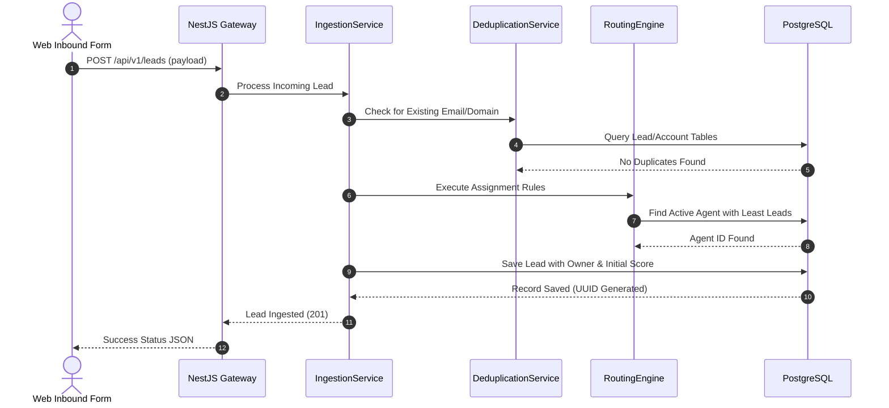

# Module 2: Lead & Pipeline Management

This document details the architecture, design, and implementation specifications for the Lead & Pipeline Management module of the Decent Global Outsourcing (DGO) CRM.

---

## 1. Problem Statement
DGO generates global B2B leads from multiple sources (events, outbound cold calling, search marketing, web contact forms). Without an organized capture engine, leads fall through the cracks, response times are slow, duplicates are frequent, and sales agents cannot score or rank leads effectively.

## 2. Objectives
- Automated ingestion of B2B leads from multiple source channels (API, Webhooks, CSV uploads).
- Implement a configurable Lead Scoring engine to prioritize warm prospects.
- Deploy automated lead assignment strategies (Round-Robin and Territory-based).
- Enforce strict validation and deduplication to maintain clean datasets.
- Facilitate one-click qualification/conversion into Accounts, Contacts, and Opportunities.

## 3. Functional Requirements
- **Lead Capture & Ingestion**: Secure public API endpoint for client website contact form integration.
- **Pipeline Stage Management**: Track leads across predefined stages: `NEW`, `CONTACTED`, `QUALIFIED`, `NURTURING`, `UNQUALIFIED`, `CONVERTED`.
- **Deduplication Engine**: Check incoming email, domain, and phone number against database records before insert.
- **Automated Routing**: Dynamically assign owners based on agent availability, current load, and geographic location.
- **Conversion Flow**: Automate creation of associated Account, Contact, and Opportunity entities upon lead qualification.

## 4. Non-Functional Requirements
- **Performance**: Lead deduplication check must execute in < 100ms for batches.
- **Scalability**: Capable of handling peaks of up to 10,000 lead submissions per hour.
- **Integrity**: Transactions during lead conversion must follow strict ACID properties via Prisma transactions.

## 5. Business Rules
- **BR1**: Leads with an organization size under 10 employees or budget less than $5,000/year are automatically flagged as `Low Priority` and routing is bypassed.
- **BR2**: When a lead is marked `Qualified`, the system *must* prompt the agent to convert it. It is forbidden to remain in `Qualified` stage without conversion for more than 48 hours.
- **BR3**: Leads inactive for more than 14 days in `Contacted` stage are automatically moved to `Nurturing` and a task is generated for the owner.
- **BR4**: A converted lead becomes read-only. Modifying historical data on a converted lead is prohibited.

## 6. User Stories
- **US2.1**: *As a Marketing Manager*, I want web forms to auto-populate leads in the CRM, so that sales reps can contact prospects within minutes.
- **US2.2**: *As a Sales Agent*, I want the system to alert me if a new lead belongs to a domain already registered in our system, so that I can coordinate with the existing account owner.
- **US2.3**: *As a Sales Director*, I want leads to be distributed evenly among active sales reps via round-robin, so that workload is balanced.

## 7. Acceptance Criteria
- **AC1**: Standard fields like Email, Company Name, and Budget must be verified prior to routing.
- **AC2**: The lead conversion screen must allow the user to select an existing Account or create a new one.
- **AC3**: Duplicate check triggers warnings if the exact email or domain matches an active Account or Contact.

## 8. UI Flow
```text
[Web Inbound / CSV / Manual Creation]
                 │
                 ▼
         [Lead Ingestion] ──► (Run Auto-Score & Duplicate Check)
                 │
                 ▼
        [Active Lead Board] (Kanban layout of stages: New -> Contacted -> Qualified)
                 │
                 ▼
         [Conversion Form] ──► (Creates Account, Contact, and Opportunity)
```

## 9. Navigation
- `/dashboard/leads`: Central list and Kanban view of active leads.
- `/dashboard/leads/:id`: Detailed view of a lead (information, notes, activity history).
- `/dashboard/settings/routing`: Management of assignment queues.

## 10. Wireframe Description
The Lead detail page is split into three columns:
- **Left Column**: Demographic details (Company name, contact details, lead source, score banner, current owner).
- **Center Column**: Dynamic activity stream and communication hub (notes input, email history, timeline feeds).
- **Right Column**: Operational commands (Stage selector stepper, convert button, tasks calendar, similar records matcher).

## 11. Database Schema
Below is the PostgreSQL schema represented in Prisma ORM format:

```prisma
model Lead {
  id             String      @id @default(dbgenerated("gen_random_uuid()")) @db.Uuid
  organizationId String      @db.Uuid
  ownerId        String?     @db.Uuid
  firstName      String      @db.VarChar(100)
  lastName       String      @db.VarChar(100)
  email          String      @db.VarChar(255)
  phone          String?     @db.VarChar(50)
  companyName    String      @db.VarChar(255)
  website        String?     @db.VarChar(255)
  source         String      @db.VarChar(100) // e.g. "WEBSITE", "COLD_CALL"
  status         LeadStatus  @default(NEW)
  score          Int         @default(0)
  budget         Decimal?    @db.Decimal(18, 2)
  notes          String?     @db.Text
  convertedAt    DateTime?   @db.Timestamptz(6)
  convertedAccountId String? @db.Uuid
  convertedContactId String? @db.Uuid
  convertedOpportunityId String? @db.Uuid
  createdAt      DateTime    @default(now()) @db.Timestamptz(6)
  updatedAt      DateTime    @updatedAt @db.Timestamptz(6)
  deletedAt      DateTime?   @db.Timestamptz(6)
  createdBy      String?     @db.Uuid
  updatedBy      String?     @db.Uuid

  organization   Organization @relation(fields: [organizationId], references: [id])
  owner          User?        @relation(fields: [ownerId], references: [id])

  @@index([organizationId])
  @@index([ownerId])
  @@index([status])
}

enum LeadStatus {
  NEW
  CONTACTED
  QUALIFIED
  NURTURING
  UNQUALIFIED
  CONVERTED
}
```

## 12. Relationships
- **Organization to Lead**: One-to-Many. Leads belong to the CRM subscriber organization context.
- **User (Owner) to Lead**: One-to-Many. A Sales Representative is assigned ownership of the lead.
- **Lead to Converted Entities**: Optional associations to converted Account, Contact, and Opportunity for lineage tracking.

## 13. Validation Rules
- `email`: Mandatory unless source is cold event, must conform to email regex.
- `budget`: Must be non-negative value.
- `companyName`: Required field, minimum 2 characters.

## 14. API Endpoints
- `GET /api/v1/leads`: Paginated, filterable list of leads.
- `POST /api/v1/leads`: Manual creation or external integration ingestion.
- `PUT /api/v1/leads/:id/stage`: Transitions a lead's stage.
- `POST /api/v1/leads/:id/convert`: Executes the conversion transaction.

## 15. Request/Response Examples

### POST `/api/v1/leads/:id/convert`
**Request Payload:**
```json
{
  "opportunityName": "DGO - 5 Full Time React Engineers Contract",
  "opportunityCloseDate": "2026-09-01T00:00:00Z",
  "opportunityStage": "PROPOSAL",
  "createNewAccount": true,
  "existingAccountId": null
}
```

**Response Payload (Status 201 Created):**
```json
{
  "success": true,
  "convertedIds": {
    "accountId": "9a38dfbb-2287-43eb-8e99-dbad4f18bc55",
    "contactId": "1bcd3342-9988-4dbf-8199-ab89004d4bed",
    "opportunityId": "fa93bc31-dd33-4ccb-a9cd-2244bbd9bcd4"
  }
}
```

## 16. Error Responses

### 422 Unprocessable Entity (Duplicate Found)
```json
{
  "statusCode": 422,
  "message": "Lead duplicate detected. Matching lead ID: 8877bcde-12ef-34ab-56cd-78ef90ab12cd.",
  "error": "Unprocessable Entity",
  "timestamp": "2026-07-15T16:15:30.000Z"
}
```

## 17. Permissions
- `leads:read`: View leads index and details.
- `leads:write`: Create, edit, change stages, and import leads.
- `leads:convert`: Authorize conversion of qualified leads to core CRM entities.

## 18. Notifications
- **Lead Assigned Alert**: Dispatched to Sales Agent immediately when a new lead is assigned.
- **Conversion Report**: Summary email generated weekly detailing conversion ratios.

## 19. Audit Logs
- **Event**: `Lead.Ingestion.Success`
  - *Data*: `{ "leadId": "fa93bc31...", "source": "WEBSITE", "score": 75 }`
- **Event**: `Lead.Converted`
  - *Data*: `{ "leadId": "fa93bc31...", "accountId": "9a38dfbb...", "convertedBy": "user-uuid" }`

## 20. Activity Timeline
- *July 15, 2026 16:13* - **Lead Created**: Ingested via API Webhook from contact form. (Score: 40)
- *July 15, 2026 16:14* - **Assigned**: Round-robin assigner routed ownership to agent `ibby1561@gmail.com`.
- *July 15, 2026 16:15* - **Status Updated**: Moved from `NEW` to `CONTACTED` by agent.

## 21. Sequence Diagram


## 22. Edge Cases
- **No Available Agents in Routing**: If the round-robin engine has no active sales agents in the system configuration, the lead is routed to a `Default Ingestion Queue` owned by the `TenantAdmin`.
- **Domain Mismatch in Conversion**: When converting a lead with domain `google.com` but user selects an existing account named `Alphabet Inc.`, the system flags this mismatch and requires confirmation from the sales agent before committing the transaction.

## 23. Future Improvements
- **Enrichment API Integrations**: Automate social data lookup (Clearbit, LinkedIn) based on email address.
- **Predictive ML Lead Scoring**: Use history to train a model that dynamic scores leads.
