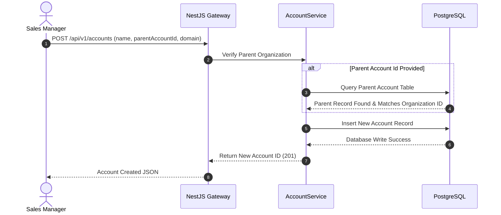

# Module 3: Account & Contact Directory (B2B)

This document details the architecture, design, and implementation specifications for the Account & Contact Directory module of the Decent Global Outsourcing (DGO) CRM.

---

## 1. Problem Statement
DGO serves massive enterprise clients that possess complex corporate structures, regional subsidiaries, and thousands of internal employees. Without a hierarchical B2B directory, DGO sales agents and delivery managers lose track of parent-subsidiary relationships, message the wrong points of contact, fail to map internal decision-makers, and cannot aggregate contract values across a corporate parent structure.

## 2. Objectives
- Establish a normalized database structure to model parent-subsidiary corporate relationships.
- Maintain a single, clean source of truth for B2B accounts and client contacts.
- Store granular stakeholder mapping details (job role, authority level, contact preferences).
- Provide unified lookup and dashboard structures to view complete account interaction histories.
- Ensure strict multi-tenant database isolation to prevent cross-account client leakage.

## 3. Functional Requirements
- **Account Hierarchy**: Model complex parent-subsidiary business trees with unlimited depth recursion.
- **Contact Directory**: Manage details for client employees (first name, last name, phone, email, division).
- **Influence/Authority Level Classification**: Classify contacts (e.g., `DECISION_MAKER`, `INFLUENCER`, `GATEKEEPER`, `USER`).
- **Enrichment Linkage**: Support custom fields for mapping external system indicators (e.g., LinkedIn URLs, Crunchbase IDs).
- **Consolidated Health Reporting**: Aggregate revenue, active tickets, and opportunities from subsidiary records to the parent account.

## 4. Non-Functional Requirements
- **Performance**: Fetching a complete 5-level deep account hierarchy tree must execute in < 250ms using optimized recursive queries.
- **Relational Integrity**: Deleting a parent account must either block if active child records exist, or re-parent child records gracefully to prevent orphan nodes.
- **User Interface**: Render large-scale hierarchy trees seamlessly in the Next.js frontend using virtualized components.

## 5. Business Rules
- **BR1**: An Account must have a valid registered business name and a country code.
- **BR2**: Contacts cannot exist without an associated active Account (No orphan contacts allowed).
- **BR3**: Only one Contact per Account can be marked as the `Primary Billing Contact`.
- **BR4**: If an Account's status is changed to `Inactive`, all associated Contacts are automatically marked as `Inactive`, preventing system outreach.

## 6. User Stories
- **US3.1**: *As an Account Executive*, I want to link "ACME Europe" as a subsidiary of "ACME Global", so that I can see the total value of our outsourcing engagements.
- **US3.2**: *As a Delivery Lead*, I want to tag ACME’s CTO as a "Decision Maker" and the Lead Architect as an "Influencer", so that I know who to contact for technical project sign-off.
- **US3.3**: *As a Billing Operations Specialist*, I want to mark the CFO as the primary billing contact, so that invoices are automatically sent to the correct email.

## 7. Acceptance Criteria
- **AC1**: Database constraints prevent multiple contacts from being marked as the primary billing contact for a single Account.
- **AC2**: UI tree widget allows drag-and-drop hierarchy adjustments with visual validation.
- **AC3**: Deleting an account must trigger a soft-delete, hiding it from directories while preserving integrity constraints.

## 8. UI Flow
```text
[Dashboard Navigation] ──► [Accounts Directory] ──► [Select Account]
                                                         │
                                                         ▼
[Subsidiaries Grid] ◄────── [Account Details Workspace] ──────► [Contacts Profile Card]
                                                                        │
                                                                        ▼
                                                             [Stakeholder Map Matrix]
```

## 9. Navigation
- `/dashboard/accounts`: Grid and list view of all clients.
- `/dashboard/accounts/:id`: Account hub (contacts tab, billing tab, hierarchy tree tab).
- `/dashboard/contacts`: Complete index of individual customer stakeholders across all client accounts.

## 10. Wireframe Description
The Account details interface is designed around a three-tab view:
- **Tab 1: Overview**: Shows core financials, firmographic data (employee count, industry, region), and a visual hierarchy chart.
- **Tab 2: Stakeholder Hub**: A list of contacts displaying title, influence rating (color-coded badges), email, phone, and dynamic engagement logs.
- **Tab 3: Operations**: Active outsourced developer squads, contract status tracker, and SLA tracking dashboard.

## 11. Database Schema
Below is the PostgreSQL schema represented in Prisma ORM format:

```prisma
model Account {
  id             String      @id @default(dbgenerated("gen_random_uuid()")) @db.Uuid
  organizationId String      @db.Uuid
  parentAccountId String?    @db.Uuid
  name           String      @db.VarChar(255)
  domain         String      @db.VarChar(255)
  industry       String?     @db.VarChar(100)
  employeeCount  Int?
  annualRevenue  Decimal?    @db.Decimal(18, 2)
  billingStreet  String?     @db.VarChar(255)
  billingCity    String?     @db.VarChar(100)
  billingCountry String      @db.VarChar(100)
  status         AccountStatus @default(ACTIVE)
  createdAt      DateTime    @default(now()) @db.Timestamptz(6)
  updatedAt      DateTime    @updatedAt @db.Timestamptz(6)
  deletedAt      DateTime?   @db.Timestamptz(6)
  createdBy      String?     @db.Uuid
  updatedBy      String?     @db.Uuid

  organization   Organization @relation(fields: [organizationId], references: [id])
  parentAccount  Account?     @relation("AccountHierarchy", fields: [parentAccountId], references: [id], onDelete: Restrict)
  subsidiaries   Account[]    @relation("AccountHierarchy")
  contacts       Contact[]
  opportunities  Opportunity[]

  @@index([organizationId])
  @@index([parentAccountId])
}

enum AccountStatus {
  ACTIVE
  INACTIVE
  ONBOARDING
}

model Contact {
  id             String         @id @default(dbgenerated("gen_random_uuid()")) @db.Uuid
  organizationId String         @db.Uuid
  accountId      String         @db.Uuid
  firstName      String         @db.VarChar(100)
  lastName       String         @db.VarChar(100)
  email          String         @db.VarChar(255)
  phone          String?        @db.VarChar(50)
  jobTitle       String?        @db.VarChar(150)
  department     String?        @db.VarChar(100)
  roleScope      ContactRole    @default(USER)
  isPrimaryBilling Boolean      @default(false)
  status         ContactStatus  @default(ACTIVE)
  createdAt      DateTime       @default(now()) @db.Timestamptz(6)
  updatedAt      DateTime       @updatedAt @db.Timestamptz(6)
  deletedAt      DateTime?      @db.Timestamptz(6)
  createdBy      String?        @db.Uuid
  updatedBy      String?        @db.Uuid

  organization   Organization   @relation(fields: [organizationId], references: [id])
  account        Account        @relation(fields: [accountId], references: [id], onDelete: Cascade)

  @@unique([organizationId, email])
  @@index([organizationId])
  @@index([accountId])
}

enum ContactRole {
  DECISION_MAKER
  INFLUENCER
  GATEKEEPER
  USER
}

enum ContactStatus {
  ACTIVE
  INACTIVE
}
```

## 12. Relationships
- **Account Self-Relation**: A parent Account points to one or more subsidiary Accounts (`AccountHierarchy`).
- **Account to Contact**: One-to-Many. Accounts own multiple contacts representing distinct client employees.
- **Organization to Account/Contact**: One-to-Many. Multi-tenancy guard rails.

## 13. Validation Rules
- `domain`: Must validate as a valid website format (e.g., `google.com`).
- `isPrimaryBilling`: Checked via custom Prisma hook/trigger. Before saving `isPrimaryBilling = true`, the system executes `UPDATE Contact SET isPrimaryBilling = false WHERE accountId = :accountId`.

## 14. API Endpoints
- `GET /api/v1/accounts`: Lists all client accounts (supports pagination, keyword filter, domain search).
- `POST /api/v1/accounts`: Registers a new Account.
- `GET /api/v1/accounts/:id/hierarchy`: Resolves recursive parent/child organizational structures.
- `POST /api/v1/contacts`: Inserts a contact linked to a parent account.
- `PUT /api/v1/contacts/:id/primary`: Sets primary billing status.

## 15. Request/Response Examples

### GET `/api/v1/accounts/68bfd88e-4a6c-4861-8ff6-3245bc98df12/hierarchy`
**Response Payload (Status 200 OK):**
```json
{
  "success": true,
  "hierarchy": {
    "id": "68bfd88e-4a6c-4861-8ff6-3245bc98df12",
    "name": "ACME Corporation Global",
    "domain": "acme.com",
    "subsidiaries": [
      {
        "id": "a9a8ee8c-b123-4567-9c88-112233445566",
        "name": "ACME Europe Ltd",
        "domain": "acme.eu",
        "subsidiaries": []
      },
      {
        "id": "f8f7ff6a-d234-5678-bd88-998877665544",
        "name": "ACME Americas Division",
        "domain": "acme.us",
        "subsidiaries": []
      }
    ]
  }
}
```

## 16. Error Responses

### 409 Conflict (Duplicate Primary Billing Contact)
```json
{
  "statusCode": 409,
  "message": "A primary billing contact already exists for Account 68bfd88e-4a6c-4861-8ff6-3245bc98df12.",
  "error": "Conflict",
  "timestamp": "2026-07-15T16:16:10.000Z"
}
```

## 17. Permissions
- `accounts:read`: View business accounts and client contacts.
- `accounts:write`: Add, update or restructure corporate accounts and parent-subsidiary tags.
- `accounts:delete`: Trigger soft-deletion parameters for accounts.

## 18. Notifications
- **Contact Info Updated**: Sent to Account Owner when contact coordinates change.
- **Parent Account Changed**: Warning email dispatched to Project Managers if a subsidiary is re-parented.

## 19. Audit Logs
- **Event**: `Account.Hierarchy.Update`
  - *Data*: `{ "accountId": "a9a8ee8c...", "oldParentId": null, "newParentId": "68bfd88e..." }`
- **Event**: `Contact.PrimaryBilling.Assigned`
  - *Data*: `{ "contactId": "1bcd3342...", "accountId": "68bfd88e..." }`

## 20. Activity Timeline
- *July 15, 2026 16:15* - **Contact Registered**: `John Doe` (CTO) added by sales rep.
- *July 15, 2026 16:15* - **Role Defined**: John Doe flagged as `DECISION_MAKER`.
- *July 15, 2026 16:16* - **Hierarchy Created**: Subsidiary ACME Europe linked to parent ACME Corporation Global.

## 21. Sequence Diagram


## 22. Edge Cases
- **Circular References**: A validation check executes on `parentAccountId` update to ensure an account is never assigned as a child of its own child (preventing infinite loops in tree traversal queries).
- **Secondary domain reuse**: Multiple accounts could claim the same top-level domain (e.g. `acme-it.com` vs `acme-billing.com`). The duplicate validation engine triggers a warning alert but permits insertion, unlike primary domain match alerts.

## 23. Future Improvements
- **Interactive Org Charts**: Interactive SVG diagram showing client contacts, reporting lines, and influence dynamics.
- **Financial Rolling Aggregator**: Automated API connector to fetch and summarize parent group balance sheets.
