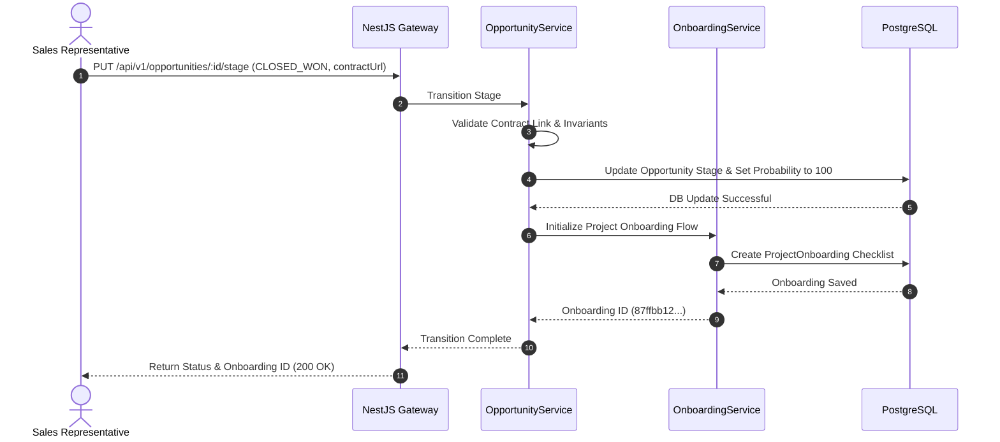

# Module 4: Opportunity & Deal Management

This document details the architecture, design, and implementation specifications for the Opportunity & Deal Management module of the Decent Global Outsourcing (DGO) CRM.

---

## 1. Problem Statement
For an outsourcing firm like DGO, deals are not simple product sales. They represent long-term commitments for developer squads, managed service agreements, and custom software delivery. Without a dedicated opportunity engine, sales reps miscalculate deal margins, fail to assign appropriate probabilities, forecast inaccurate revenues, and lose valuable context on why deals are lost to competitors.

## 2. Objectives
- Track sales pipelines with custom, weight-adjusted stage categories.
- Calculate weighted revenue forecasts (Amount × Probability) to assist management in capacity planning.
- Store critical context like key competitor metrics and win/loss analysis.
- Enforce strict database validation on deal amounts, discounts, and margins.
- Provide direct transition capabilities into Project Onboarding (Module 5) and Billing (Module 6) upon winning a deal.

## 3. Functional Requirements
- **Pipeline Stepper**: Track deals across phases: `DISCOVERY` (10%), `PROPOSAL` (40%), `NEGOTIATION` (70%), `CLOSED_WON` (100%), `CLOSED_LOST` (0%).
- **Multi-Currency Capability**: Handle international client engagements using baseline exchange conversion tables.
- **Weighted Value Computations**: Automated calculation of weighted pipeline amounts for real-time reporting.
- **Competitor Tracking**: Document which competitors are pitching and the client's key decision factors.
- **Post-Mortem Logger**: Mandate structural fields describing loss reasons (e.g., pricing, technical mismatch) for closed-lost opportunities.

## 4. Non-Functional Requirements
- **Performance**: Recalculating aggregated team pipeline values must be cached via Redis, returning metrics in < 50ms.
- **Auditing**: History of all stage adjustments, deal amount alterations, and owner modifications must be archived permanently.
- **Concurrency**: Prevent race conditions when multiple sales executives update the same opportunity using PostgreSQL row locking (`SELECT FOR UPDATE`).

## 5. Business Rules
- **BR1**: An opportunity value cannot exceed $10,000,000 without automatic approval routing to the VP of Sales.
- **BR2**: Transition to `CLOSED_WON` requires uploading a Signed Statement of Work (SOW) or Contract draft link.
- **BR3**: Transition to `CLOSED_LOST` requires completing the `lossReason` and `competitorLostTo` text attributes.
- **BR4**: A deal's close date cannot be set in the past.

## 6. User Stories
- **US4.1**: *As a Sales Agent*, I want to create a deal named "ACME - 10 Java Devs" linked to ACME Corporation, so that I can track our progress through negotiation.
- **US4.2**: *As a Chief Financial Officer*, I want to see the total expected revenue for Q3 calculated by multiplying each deal's budget by its stage probability, so that I can plan recruiting resources.
- **US4.3**: *As a Product Manager*, I want to analyze why we lost three major proposals last month, so that we can adjust our service pricing framework.

## 7. Acceptance Criteria
- **AC1**: System automatically recalculates the `weightedValue` attribute upon any change to the `amount` or `stage` (probability change).
- **AC2**: Moving a deal to `CLOSED_WON` generates an onboarding checklist task automatically inside the Onboarding Module.
- **AC3**: Minimum budget rules are enforced; any deal with an amount of $0 cannot be moved past the `DISCOVERY` stage.

## 8. UI Flow
```text
[Accounts Hub / Leads Conversion]
                 │
                 ▼
      [Opportunity Creator] ──► (Validates Close Date & Amount)
                 │
                 ▼
      [Opportunity Detail Workspace]
                 ├───► [Competitor Log]
                 ├───► [Weighted Calculator Alert]
                 └───► [Stage Progression Stepper]
                             │
                             ├─► [CLOSED_LOST] ──► Requires post-mortem input
                             └─► [CLOSED_WON]  ──► Triggers Onboarding pipeline
```

## 9. Navigation
- `/dashboard/opportunities`: Main pipeline board displaying opportunities as draggable cards.
- `/dashboard/opportunities/:id`: Central workspace for a deal (includes documents, pricing calculator, competitors).
- `/dashboard/analytics/forecast`: Forecast reporting page displaying pipeline coverage.

## 10. Wireframe Description
The Opportunity Detail interface displays:
- **Header**: Large deal title, target account link, owner avatar, total amount, and color-coded stage banner.
- **Stage Stepper**: A horizontal progress bar mapping stages. Clicking on a stage displays the action checklist required to progress (e.g. "Send proposal document").
- **Core Panels**: Left panel handles financial projections (margin calculator, headcount needed, rate card). Center panel details logs and timeline events. Right panel lists attached files, competitor matrices, and win/loss questionnaires.

## 11. Database Schema
Below is the PostgreSQL schema represented in Prisma ORM format:

```prisma
model Opportunity {
  id             String            @id @default(dbgenerated("gen_random_uuid()")) @db.Uuid
  organizationId String            @db.Uuid
  accountId      String            @db.Uuid
  ownerId        String?           @db.Uuid
  name           String            @db.VarChar(255)
  stage          OpportunityStage  @default(DISCOVERY)
  amount         Decimal           @db.Decimal(18, 2)
  probability    Int               @default(10) // Percentage: 10, 40, 70, 100, 0
  closeDate      DateTime          @db.Timestamptz(6)
  description    String?           @db.Text
  lossReason     String?           @db.Text
  competitorLostTo String?         @db.VarChar(255)
  createdAt      DateTime          @default(now()) @db.Timestamptz(6)
  updatedAt      DateTime          @updatedAt @db.Timestamptz(6)
  deletedAt      DateTime?         @db.Timestamptz(6)
  createdBy      String?           @db.Uuid
  updatedBy      String?           @db.Uuid

  organization   Organization      @relation(fields: [organizationId], references: [id])
  account        Account           @relation(fields: [accountId], references: [id], onDelete: Cascade)
  owner          User?             @relation(fields: [ownerId], references: [id])
  onboardings    ProjectOnboarding[]

  @@index([organizationId])
  @@index([accountId])
  @@index([stage])
}

enum OpportunityStage {
  DISCOVERY
  PROPOSAL
  NEGOTIATION
  CLOSED_WON
  CLOSED_LOST
}
```

## 12. Relationships
- **Account to Opportunity**: One-to-Many. Accounts can run multiple outsourcing opportunities simultaneously (different teams or projects).
- **Opportunity to ProjectOnboarding**: One-to-Many. A won opportunity triggers one or more concrete project onboarding initiatives.
- **User (Owner) to Opportunity**: One-to-Many. Sales representatives manage specific deals.

## 13. Validation Rules
- `amount`: Must be greater than or equal to 0.00.
- `probability`: System controlled. Must fall in: 10 (Discovery), 40 (Proposal), 70 (Negotiation), 100 (Won), 0 (Lost) unless overridden by SuperAdmin customized parameters.
- `closeDate`: Must not be in the past at creation time.

## 14. API Endpoints
- `GET /api/v1/opportunities`: Retrieves opportunities with filtering options.
- `POST /api/v1/opportunities`: Initiates a new deal record.
- `PUT /api/v1/opportunities/:id`: Updates basic deal metrics.
- `PUT /api/v1/opportunities/:id/stage`: Transitions deal stage and updates probability scores automatically.
- `POST /api/v1/opportunities/:id/close`: Specifically closes a deal (requiring win/loss properties).

## 15. Request/Response Examples

### PUT `/api/v1/opportunities/:id/stage`
**Request Payload:**
```json
{
  "stage": "CLOSED_WON",
  "contractUrl": "https://secure-storage.decentglobal.com/contracts/sow_acme_102.pdf"
}
```

**Response Payload (Status 200 OK):**
```json
{
  "success": true,
  "opportunity": {
    "id": "77ccaa89-2287-43eb-8e99-dbad4f18bc55",
    "name": "ACME - 10 Java Devs",
    "stage": "CLOSED_WON",
    "probability": 100,
    "amount": "120000.00",
    "closeDate": "2026-08-30T00:00:00.000Z"
  },
  "triggeredOnboardingId": "87ffbb12-bbff-4b4b-aa22-dbcd990022ff"
}
```

## 16. Error Responses

### 400 Bad Request (Missing Close Reason)
```json
{
  "statusCode": 400,
  "message": "Moving to stage CLOSED_LOST requires specifying a lossReason.",
  "error": "Bad Request",
  "timestamp": "2026-07-15T16:17:00.000Z"
}
```

## 17. Permissions
- `opportunities:read`: Search and view B2B deals.
- `opportunities:write`: Add and update deals, configure margin models.
- `opportunities:approve`: Approve deals exceeding $10,000,000 threshold bounds.

## 18. Notifications
- **Deal Won Announcement**: System-wide email and Slack notification dispatched when a major deal reaches `CLOSED_WON`.
- **Close Date Exceeded Alert**: Automatic notification to owner when close date passes without status resolution.

## 19. Audit Logs
- **Event**: `Opportunity.StageChanged`
  - *Data*: `{ "dealId": "77ccaa89...", "from": "NEGOTIATION", "to": "CLOSED_WON", "user": "user-uuid" }`
- **Event**: `Opportunity.AmountModified`
  - *Data*: `{ "dealId": "77ccaa89...", "oldAmount": "100000.00", "newAmount": "120000.00" }`

## 20. Activity Timeline
- *July 15, 2026 16:15* - **Deal Opened**: Discovery stage initialized for ACME Corporation. Value: $120,000.
- *July 15, 2026 16:16* - **Proposal Sent**: Proposal PDF linked. Stage updated to `PROPOSAL` (Probability: 40%).
- *July 15, 2026 16:17* - **Deal Won**: Statement of Work signed. Stage updated to `CLOSED_WON` (Probability: 100%).

## 21. Sequence Diagram


## 22. Edge Cases
- **Exchange Rate Volatility**: Opportunities saved in currencies other than USD calculate weighted values using the cached daily exchange rate. If rates fluctuate more than 5% during negotiation, the system alerts the owner to verify pricing margins.
- **Retroactive Win/Loss Alterations**: Once a deal is set to `CLOSED_WON` or `CLOSED_LOST`, the stage is locked. Any request to return to negotiation requires TenantAdmin verification, preserving clean pipeline statistics.

## 23. Future Improvements
- **Automatic Forecast Modeler**: Integrate machine learning models to calculate custom deal probabilities based on previous history, competitor profiles, and account communications.
- **Contract Signature Auto-parser**: Integrate OCR/AI to read uploaded contract PDFs and auto-verify start date, billing rates, and headcount commitments.
