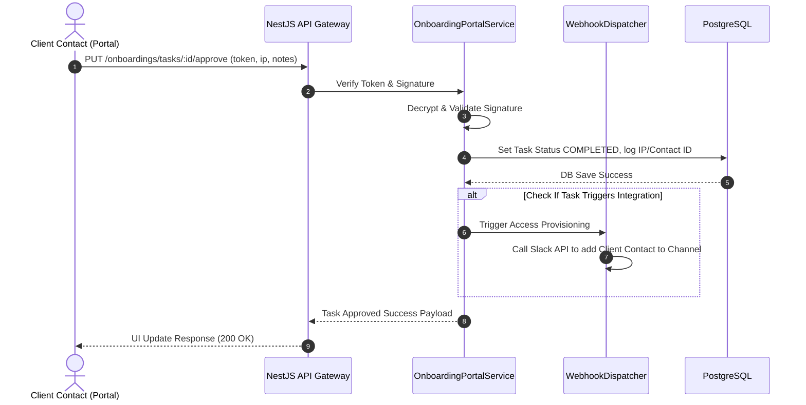

# Module 5: Project Onboarding & SLA Management

This document details the architecture, design, and implementation specifications for the Project Onboarding & Service Level Agreement (SLA) Management module of the Decent Global Outsourcing (DGO) CRM.

---

## 1. Problem Statement
Winning a B2B outsourcing deal is only the beginning. The transition from "Deal Closed" to "Billable Team Working" frequently stalls due to manual project setups (repo creations, developer access grants, Slack configurations), delayed client approvals, and ill-defined service level agreements. Without automation, onboarding takes weeks instead of days, resulting in lost revenue and dissatisfied clients on day one.

## 2. Objectives
- Automated generation of standardized project onboarding checklists upon winning opportunities.
- Establish a secure Client Portal dashboard to allow client stakeholders to track setup progress and sign off on tasks.
- Centralize SLA targets (Response Time, Resolution Time, Resource Allocation Speed) associated with client contracts.
- Integrate infrastructure triggers (webhooks) to automate workspace creation (e.g. GitHub repos, Slack channels).
- Provide real-time SLA breach warnings and automated escalation flows.

## 3. Functional Requirements
- **Checklist Engine**: Create dynamic tasks based on project templates (e.g., "Staff Augmentation" vs "Dedicated Managed Squad").
- **Client Sign-off Interface**: Provide secure single-purpose login/token verification for client contacts to approve specific checklists.
- **SLA Policy Matrix**: Define SLA policies specifying:
  * Critical (P1) Response: 1 Hour, Resolution: 4 Hours.
  * High (P2) Response: 4 Hours, Resolution: 24 Hours.
  * Medium (P3) Response: 24 Hours, Resolution: 72 Hours.
- **Breach Timer**: Dynamic timer tracking active tickets or onboarding stages against defined SLA parameters.
- **Escalation Rules**: Chain commands to reassign tasks and alert executives when SLA limits approach 80% threshold.

## 4. Non-Functional Requirements
- **Auditability**: Every checklist approval or modification must store client IP address, timestamp, and verification certificate hash.
- **Performance**: Real-time timer updates and SLA monitoring daemon overhead must be low (< 1% CPU utilization on Database).
- **Security**: Client approvals must utilize signed payloads (HMAC-SHA256) to ensure non-repudiation.

## 5. Business Rules
- **BR1**: Onboarding checklists must be fully approved by the client contact before billing start dates can be authorized.
- **BR2**: Project onboarding teams cannot request developer assignments (Module 7) until "Developer Access Credentials Provisioned" step is completed.
- **BR3**: SLA definitions must be linked to a valid closed-won Opportunity and an active Billing Contract.
- **BR4**: In the event of a P1 SLA breach, a system alert is triggered to the delivery head, and an audit trail entry is finalized.

## 6. User Stories
- **US5.1**: *As a Project Manager*, I want the system to generate onboarding tasks (GitHub Setup, Slack Setup, Developer Background Checks) as soon as the deal is won, so we can begin delivery immediately.
- **US5.2**: *As a Client Sponsor*, I want to log into my portal, review the backgrounds of proposed developers, and approve their allocation with a single click.
- **US5.3**: *As a Operations Director*, I want to receive an SMS or dashboard notification if an onboarding task is stalled for more than 48 hours, so that I can intervene.

## 7. Acceptance Criteria
- **AC1**: Onboarding templates support conditional tasks depending on region or technical stack.
- **AC2**: Next.js client portal shows a step-by-step wizard matching the backend project state.
- **AC3**: SLA breach calculations run asynchronously as background Cron tasks every 5 minutes.

## 8. UI Flow
```text
[Deal Won Trigger] ──► [Auto-Generate Project Checklist]
                              │
                              ├─► (Trigger Webhooks: Create GitHub & Slack)
                              ▼
                   [Client Portal Invitation Email]
                              │
                              ▼
                [Client Approval Board (Next.js)]
                              │
                              ├─► Approve CVs / Access credentials
                              ▼
                 [Project Flagged: Onboarding Complete] ──► Start SLA Tracker
```

## 9. Navigation
- `/dashboard/onboardings`: PM view tracking all active client onboardings.
- `/dashboard/onboardings/:id`: Onboarding status page, checklist steps, and resource lists.
- `/portal/onboardings/:token`: External client access portal showing customized progress lists.

## 10. Wireframe Description
The Client Portal Onboarding view displays:
- **Header**: DGO logo, Client company name, onboarding team profile widgets.
- **Stepper Widget**: Clean timeline stepper indicating "Initiation", "Access Setup", "Resource Vetting", "Kickoff Ready".
- **Checklist Cards**: Individual task panels showing:
  - Task title & description.
  - Status (Pending, Completed, Approved).
  - "Approve" button with secondary "Raise Concern" input form.
  - File attachments (Resume PDFs, access credentials).

## 11. Database Schema
Below is the PostgreSQL schema represented in Prisma ORM format:

```prisma
model ProjectOnboarding {
  id             String           @id @default(dbgenerated("gen_random_uuid()")) @db.Uuid
  organizationId String           @db.Uuid
  opportunityId  String           @db.Uuid
  name           String           @db.VarChar(255)
  status         OnboardingStatus @default(IN_PROGRESS)
  templateType   String           @db.VarChar(50) // e.g. "STAFF_AUGMENTATION", "MANAGED_SQUAD"
  targetStartDate DateTime         @db.Timestamptz(6)
  completedAt    DateTime?        @db.Timestamptz(6)
  createdAt      DateTime         @default(now()) @db.Timestamptz(6)
  updatedAt      DateTime         @updatedAt @db.Timestamptz(6)
  deletedAt      DateTime?        @db.Timestamptz(6)

  organization   Organization     @relation(fields: [organizationId], references: [id])
  opportunity    Opportunity      @relation(fields: [opportunityId], references: [id])
  checklistItems OnboardingTask[]
  slaPolicies    SlaPolicy[]

  @@index([organizationId])
  @@index([opportunityId])
}

enum OnboardingStatus {
  IN_PROGRESS
  SUSPENDED
  COMPLETED
}

model OnboardingTask {
  id                  String             @id @default(dbgenerated("gen_random_uuid()")) @db.Uuid
  projectOnboardingId String             @db.Uuid
  title               String             @db.VarChar(255)
  description         String?            @db.Text
  isRequiredForBilling Boolean           @default(true)
  status              TaskStatus         @default(TODO)
  assignedToUser      String?            @db.Uuid
  approvedByContactId String?            @db.Uuid
  approvedAt          DateTime?          @db.Timestamptz(6)
  approvalIpAddress   String?            @db.VarChar(45)
  completedAt         DateTime?          @db.Timestamptz(6)

  projectOnboarding   ProjectOnboarding  @relation(fields: [projectOnboardingId], references: [id], onDelete: Cascade)

  @@index([projectOnboardingId])
}

enum TaskStatus {
  TODO
  IN_PROGRESS
  PENDING_CLIENT_APPROVAL
  COMPLETED
}

model SlaPolicy {
  id                  String             @id @default(dbgenerated("gen_random_uuid()")) @db.Uuid
  projectOnboardingId String             @db.Uuid
  severity            SlaSeverity
  responseTimeHours   Int
  resolutionTimeHours Int
  escalationUserEmail String             @db.VarChar(255)
  createdAt           DateTime           @default(now()) @db.Timestamptz(6)

  projectOnboarding   ProjectOnboarding  @relation(fields: [projectOnboardingId], references: [id], onDelete: Cascade)

  @@index([projectOnboardingId])
}

enum SlaSeverity {
  P1_CRITICAL
  P2_HIGH
  P3_MEDIUM
  P4_LOW
}
```

## 12. Relationships
- **Opportunity to ProjectOnboarding**: One-to-Many. Linked won deals spawn the structured delivery onboarding records.
- **ProjectOnboarding to OnboardingTask**: One-to-Many. Granular setup checklist steps.
- **ProjectOnboarding to SlaPolicy**: One-to-Many. Defines the operational agreements that apply post-onboarding.

## 13. Validation Rules
- `targetStartDate`: Cannot exceed 90 days from the current date.
- `approvedAt`: Must be set only when status transitions to `COMPLETED` and `approvedByContactId` is not null.

## 14. API Endpoints
- `GET /api/v1/onboardings`: List ongoing client onboarding campaigns.
- `POST /api/v1/onboardings/generate`: Auto-generates checklist from template based on Opportunity ID.
- `PUT /api/v1/onboardings/tasks/:id/approve`: Endpoint for portal token approvals.
- `GET /api/v1/onboardings/portal-auth/:token`: Verifies client single-use access credentials.

## 15. Request/Response Examples

### PUT `/api/v1/onboardings/tasks/99aa88ff-4a6c-4861-8ff6-3245bc98df12/approve`
**Request Payload:**
```json
{
  "portalToken": "token_sig_hmac_1234567890",
  "clientContactId": "1bcd3342-9988-4dbf-8199-ab89004d4bed",
  "ipAddress": "203.0.113.195",
  "notes": "Approved proposed engineers profiles. CVs conform to requirements."
}
```

**Response Payload (Status 200 OK):**
```json
{
  "success": true,
  "taskId": "99aa88ff-4a6c-4861-8ff6-3245bc98df12",
  "status": "COMPLETED",
  "approvedBy": "1bcd3342-9988-4dbf-8199-ab89004d4bed",
  "remainingTasksCount": 2
}
```

## 16. Error Responses

### 403 Forbidden (Invalid Client Portal Token)
```json
{
  "statusCode": 403,
  "message": "Invalid or expired client portal token. Access denied.",
  "error": "Forbidden",
  "timestamp": "2026-07-15T16:18:22.000Z"
}
```

## 17. Permissions
- `onboardings:read`: View status metrics of project onboardings.
- `onboardings:write`: Create checklist templates, override checklist items.
- `onboardings:portal_access`: Special scoped role mapping client contacts to specific portal links.

## 18. Notifications
- **Task Verification Pending**: SMS and Email alert dispatched to Client Primary Contact when a reviewable profile is submitted.
- **SLA Breach Warning**: Alert to Delivery Manager when an onboarding checklist task remains incomplete 12 hours prior to start date SLA.

## 19. Audit Logs
- **Event**: `Onboarding.TaskApproved`
  - *Data*: `{ "taskId": "99aa88ff...", "contactId": "1bcd3342...", "ip": "203.0.113.195" }`
- **Event**: `SlaPolicy.BreachAlert`
  - *Data*: `{ "policyId": "33ff...", "project": "ACME - Onboarding", "severity": "P1_CRITICAL" }`

## 20. Activity Timeline
- *July 15, 2026 16:17* - **Onboarding Started**: Campaign "ACME - 10 Java Devs" initialized.
- *July 15, 2026 16:18* - **Provisioning Webhook**: GitHub Repository `acme-outsourcing-squad` created.
- *July 15, 2026 16:19* - **Client Approved**: Step "Developer Background Checks" approved by John Doe from IP 203.0.113.195.

## 21. Sequence Diagram


## 22. Edge Cases
- **Client Revoking Approvals Retroactively**: Once a client approves a CV or onboarding step, the state is committed. If they request changes, they must submit a ticket to the PM; they cannot retroactively click "Disapprove" on already completed stepper components.
- **Stalled Token Lifecycle**: If a portal token expires (7 days duration limit), client click actions return a 403 error. The system must automatically prompt them to request a new validation magic link via their registered email address.

## 23. Future Improvements
- **Automated sandbox setup**: Integration with AWS/GCP APIs to spin up isolated virtual developer machines automatically on approval.
- **AI-driven SLA Predictor**: Scan historical check-ins to alert project managers if a developer is lagging behind target SLA deliveries.
```
