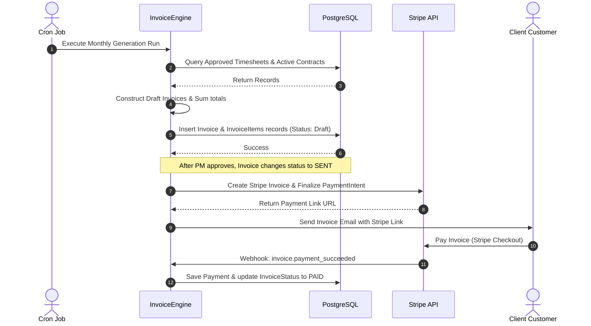

# Module 6: Contract, Billing & Subscription Management

This document details the architecture, design, and implementation specifications for the Contract, Billing & Subscription Management module of the Decent Global Outsourcing (DGO) CRM.

---

## 1. Problem Statement
DGO deals with multiple billing models: hourly resource rates, fixed-price project milestones, monthly retainers, and software licenses. Manually calculating monthly invoices based on developer hours, managing subscription billing cycles, tracking outstanding payments, and integrating Stripe webhooks without a unified system causes delayed payments, invoice discrepancies, and heavy administrative overhead.

## 2. Objectives
- Support unified management of B2B client contracts, subscriptions, and ad-hoc invoices.
- Fully integrate with Stripe for automated payment collection (Credit Card, ACH, SEPA).
- Automate monthly invoice generation by aggregating approved developer timesheet records.
- Implement robust webhook handlers to track Stripe transaction states and resolve failed payments.
- Enforce strict financial auditability matching GAAP compliance rules.

## 3. Functional Requirements
- **Subscription Management**: Define recurring billing plans linked to customer accounts.
- **Dynamic Invoice Generator**: Cron-based engine that aggregates billable timesheet hours and generates itemized drafts.
- **Stripe Synchronization**: Secure client checkout sessions, tokenizing credit cards, and processing ACH mandates.
- **Dunning Management**: Implement automatic multi-step recovery schedules for declined cards.
- **Credit Memos & Discounts**: Apply custom discounts or refunds to client accounts with proper manager approvals.

## 4. Non-Functional Requirements
- **Financial Consistency**: Monetary operations must use PostgreSQL `NUMERIC(18, 4)` and be computed in fractional cents (integers) in application code to prevent floating-point rounding errors.
- **Security (PCI DSS)**: Zero payment card detail storage on DGO infrastructure. All card tokens route directly to Stripe.
- **Reliability**: Webhook processors must be idempotent, storing raw payloads in an inbox table to prevent duplicate invoice settlement.

## 5. Business Rules
- **BR1**: Invoices are generated as `DRAFT` status and must be reviewed and approved by a Project Manager before dispatching to clients.
- **BR2**: Late payment fees (1.5% compounding interest) are automatically applied to invoices 15 days past due.
- **BR3**: A contract billing rate cannot be modified mid-cycle. Modifications take effect on the first day of the subsequent billing cycle.
- **BR4**: Subscriptions are automatically suspended if a payment fails 3 consecutive retries over 9 days.

## 6. User Stories
- **US6.1**: *As an Account Executive*, I want to create a monthly retainer contract of $10,000 for ACME Corporation, so that they are billed automatically on the 1st of every month.
- **US6.2**: *As a Developer Lead*, I want my squad’s billable hours to be compiled directly into a PDF draft invoice, so that I don't have to compile invoices manually.
- **US6.3**: *As a Client CFO*, I want to receive a secure link to pay outstanding invoices via ACH transfer, so that we can automate our accounts payable.

## 7. Acceptance Criteria
- **AC1**: Draft invoices list detailed time entries (developer name, date, hours, hourly rate).
- **AC2**: Stripe webhook processing must verify the signature (`stripe-signature`) using the raw request body.
- **AC3**: Payment refunds must be linked to the original invoice, updating the ledger balances automatically.

## 8. UI Flow
```text
[Billing Dashboard] ──► [Select Active Contract]
                              │
                              ▼
                 [Timesheets Consolidated Draft] ──► [Manager Review & Approve]
                                                          │
                                                          ▼
             [Stripe Webhook Update] ◄── [Stripe Checkout Invoice Sent]
                        │
                        ▼
            [Ledger Settled Notification]
```

## 9. Navigation
- `/dashboard/billing`: Central dashboard displaying revenue ARR, MRR, outstanding receivables, and recent payments.
- `/dashboard/billing/contracts`: List and setup of billing retainer contracts.
- `/dashboard/billing/invoices`: Invoice logs, drafts, approvals, and PDF export tool.
- `/portal/billing/:invoiceId`: Secure payment page for clients.

## 10. Wireframe Description
The Billing Dashboard contains a main canvas displaying:
- **Metrics Strip**: KPI tiles showing "Monthly Recurring Revenue (MRR)", "Total Outstanding Invoices", "Collections Ratio".
- **Invoice Table**: Columns for Invoice Number, Account Name, Issue Date, Due Date, Total Amount, Status (Draft, Sent, Paid, Overdue).
- **Control Bar**: Quick action buttons to "Generate Drafts", "Export CSV", "Stripe Settings".

## 11. Database Schema
Below is the PostgreSQL schema represented in Prisma ORM format:

```prisma
model Contract {
  id             String          @id @default(dbgenerated("gen_random_uuid()")) @db.Uuid
  organizationId String          @db.Uuid
  accountId      String          @db.Uuid
  title          String          @db.VarChar(255)
  stripeCustomerId String?       @db.VarChar(100)
  billingCycle   BillingCycle    @default(MONTHLY)
  baseAmount     Decimal         @db.Decimal(18, 4)
  currency       String          @default("USD") @db.VarChar(3)
  startDate      DateTime        @db.Timestamptz(6)
  endDate        DateTime?       @db.Timestamptz(6)
  status         ContractStatus  @default(ACTIVE)
  createdAt      DateTime        @default(now()) @db.Timestamptz(6)
  updatedAt      DateTime        @updatedAt @db.Timestamptz(6)
  deletedAt      DateTime?       @db.Timestamptz(6)

  organization   Organization    @relation(fields: [organizationId], references: [id])
  account        Account         @relation(fields: [accountId], references: [id], onDelete: Cascade)
  invoices       Invoice[]
  contractItems  ContractItem[]

  @@index([organizationId])
  @@index([accountId])
}

enum BillingCycle {
  BI_WEEKLY
  MONTHLY
  QUARTERLY
}

enum ContractStatus {
  DRAFT
  ACTIVE
  EXPIRED
  CANCELLED
}

model ContractItem {
  id          String   @id @default(dbgenerated("gen_random_uuid()")) @db.Uuid
  contractId  String   @db.Uuid
  description String   @db.VarChar(255)
  unitPrice   Decimal  @db.Decimal(18, 4)
  quantity    Decimal  @db.Decimal(18, 4)
  isRecurring Boolean  @default(true)

  contract    Contract @relation(fields: [contractId], references: [id], onDelete: Cascade)
}

model Invoice {
  id             String        @id @default(dbgenerated("gen_random_uuid()")) @db.Uuid
  organizationId String        @db.Uuid
  accountId      String        @db.Uuid
  contractId     String?       @db.Uuid
  invoiceNumber  String        @unique @db.VarChar(50) // e.g. "INV-2026-0001"
  status         InvoiceStatus @default(DRAFT)
  subTotal       Decimal       @db.Decimal(18, 4)
  taxAmount      Decimal       @db.Decimal(18, 4)
  discountAmount Decimal       @db.Decimal(18, 4)
  totalAmount    Decimal       @db.Decimal(18, 4)
  currency       String        @default("USD") @db.VarChar(3)
  dueDate        DateTime      @db.Timestamptz(6)
  paidAt         DateTime?     @db.Timestamptz(6)
  stripeInvoiceId String?      @db.VarChar(100)
  createdAt      DateTime      @default(now()) @db.Timestamptz(6)
  updatedAt      DateTime      @updatedAt @db.Timestamptz(6)

  organization   Organization  @relation(fields: [organizationId], references: [id])
  account        Account       @relation(fields: [accountId], references: [id], onDelete: Cascade)
  contract       Contract?     @relation(fields: [contractId], references: [id])
  invoiceItems   InvoiceItem[]
  payments       Payment[]

  @@index([organizationId])
  @@index([accountId])
}

enum InvoiceStatus {
  DRAFT
  PENDING_APPROVAL
  SENT
  PAID
  VOID
  OVERDUE
}

model InvoiceItem {
  id          String   @id @default(dbgenerated("gen_random_uuid()")) @db.Uuid
  invoiceId   String   @db.Uuid
  description String   @db.VarChar(255)
  quantity    Decimal  @db.Decimal(18, 4)
  unitPrice   Decimal  @db.Decimal(18, 4)
  totalPrice  Decimal  @db.Decimal(18, 4)

  invoice     Invoice  @relation(fields: [invoiceId], references: [id], onDelete: Cascade)
}

model Payment {
  id             String        @id @default(dbgenerated("gen_random_uuid()")) @db.Uuid
  organizationId String        @db.Uuid
  invoiceId      String        @db.Uuid
  stripePaymentId String       @unique @db.VarChar(100)
  amount         Decimal       @db.Decimal(18, 4)
  paymentMethod  String        @db.VarChar(50) // e.g. "CARD", "ACH"
  status         PaymentStatus @default(SUCCESS)
  createdAt      DateTime      @default(now()) @db.Timestamptz(6)

  organization   Organization  @relation(fields: [organizationId], references: [id])
  invoice        Invoice       @relation(fields: [invoiceId], references: [id], onDelete: Cascade)

  @@index([organizationId])
  @@index([invoiceId])
}

enum PaymentStatus {
  PENDING
  SUCCESS
  FAILED
  REFUNDED
}

model StripeWebhookInbox {
  id        String   @id @default(dbgenerated("gen_random_uuid()")) @db.Uuid
  eventId   String   @unique @db.VarChar(100)
  payload   Json
  status    String   @db.VarChar(50) // "PENDING", "PROCESSED", "FAILED"
  createdAt DateTime @default(now()) @db.Timestamptz(6)
}
```

## 12. Relationships
- **Contract to Invoice**: One-to-Many. Recurring cycles issue distinct invoice documents.
- **Invoice to InvoiceItem**: One-to-Many. Lists detail items (hours, fees, software tools).
- **Invoice to Payment**: One-to-Many. Multiple payment attempts or partial payments linked to a single invoice balance.
- **Account to Contract**: One-to-Many. An account maintains active subscription contracts.

## 13. Validation Rules
- `invoiceNumber`: Must comply with corporate alphanumeric standards (`INV-YYYY-XXXXX`).
- `currency`: Valid 3-letter ISO code.
- `totalAmount`: Must match sum of `InvoiceItems` totalPrice minus discounts plus tax calculations.

## 14. API Endpoints
- `POST /api/v1/billing/contracts`: Creates a new contract schema.
- `POST /api/v1/billing/invoices/generate-drafts`: Executed via Cron, compiles billable items.
- `PUT /api/v1/billing/invoices/:id/approve`: Project Manager approves the invoice and dispatches it.
- `POST /api/v1/billing/webhooks/stripe`: Public Stripe webhook endpoint.

## 15. Request/Response Examples

### POST `/api/v1/billing/webhooks/stripe`
**Request Headers:**
```text
stripe-signature: t=1611111111,v1=99ffeeddccbbaa...
```
**Request Payload:**
```json
{
  "id": "evt_1J234567890",
  "object": "event",
  "type": "invoice.payment_succeeded",
  "data": {
    "object": {
      "id": "in_1J2345",
      "customer": "cus_9988ff",
      "amount_paid": 1000000,
      "charge": "ch_12345",
      "currency": "usd"
    }
  }
}
```

**Response Payload (Status 200 OK):**
```json
{
  "received": true,
  "processed": true,
  "eventId": "evt_1J234567890"
}
```

## 16. Error Responses

### 409 Conflict (Duplicate Webhook Processing)
```json
{
  "statusCode": 409,
  "message": "Webhook event evt_1J234567890 has already been processed.",
  "error": "Conflict",
  "timestamp": "2026-07-15T16:20:00.000Z"
}
```

## 17. Permissions
- `billing:read`: View ledger balances, invoice history, payment structures.
- `billing:write`: Create contracts, adjust invoice templates, issue credit notes.
- `billing:approve`: Finalize invoice drafts for shipping to customers.

## 18. Notifications
- **Invoice Issued Alert**: Email containing invoice link sent to primary billing contact.
- **Payment Success Confirmation**: PDF receipt sent to client on successful charge.
- **Payment Failed Critical Alert**: Dispatched to Account owner when dunning attempts fail.

## 19. Audit Logs
- **Event**: `Invoice.Approved`
  - *Data*: `{ "invoiceId": "fa93...", "total": 12500.00, "approvedBy": "user-uuid" }`
- **Event**: `Webhook.Processed`
  - *Data*: `{ "eventId": "evt_1J23...", "type": "invoice.payment_succeeded" }`

## 20. Activity Timeline
- *July 15, 2026 16:18* - **Draft Invoice Created**: Invoice #INV-2026-0001 compiled containing 120 billable hours.
- *July 15, 2026 16:19* - **Invoice Approved**: Approved and sent to client by manager `ibby1561@gmail.com`.
- *July 15, 2026 16:20* - **Payment Received**: Stripe reported successful ACH payment. Status: `PAID`.

## 21. Sequence Diagram


## 22. Edge Cases
- **Stripe Outage during Webhook Dispatch**: Webhook operations must be retried by Stripe. Our database tracks received events using `StripeWebhookInbox` ensuring that if Stripe sends duplicate events during recovery, we process the transaction exactly once.
- **Timesheet modification post-billing**: If hours are modified after an invoice changes from `DRAFT` to `SENT`, direct modification is blocked. Discrepancies are handled by issuing a custom credit note or applying adjustments on the subsequent month's invoice.

## 23. Future Improvements
- **Automated Tax Compliance (Avalara/Stripe Tax)**: Integrate automatic calculations of VAT and regional sales tax depending on client corporate registration addresses.
- **Cryptocurrency Settle Gateway**: Support smart-contract based stablecoin settlement (USDC) for global outsourcing clients.
