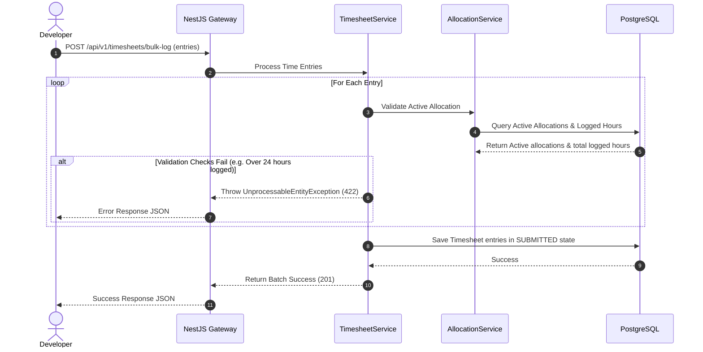

# Module 7: Resource Allocation, Timesheets & Task Management

This document details the architecture, design, and implementation specifications for the Resource Allocation, Timesheets & Task Management module of the Decent Global Outsourcing (DGO) CRM.

---

## 1. Problem Statement
Outsourcing operations rely on maximizing developer utilization while meeting project delivery deadlines. Without integrated resource management and timesheets, managers struggle to allocate talent, tracking developer allocations across multiple clients is prone to scheduling conflicts, developers submit timesheets late or with incorrect billing targets, and invoice calculations (Module 6) are delayed due to manual validation spreadsheets.

## 2. Objectives
- Track developer and team assignments to client projects with precise percentage allocation metrics.
- Establish a timesheet logging system for tracking daily/weekly billable and non-billable hours.
- Implement an automated weekly approval workflow for project managers to authorize time entries.
- Provide built-in Kanban boards to manage project tasks, sprint deadlines, and deliverables.
- Enforce strict database validations to prevent resource over-allocation (over 100% capacity).

## 3. Functional Requirements
- **Allocation Manager**: Interface to assign staff to projects (e.g. Developer John Doe is allocated 50% to ACME Project and 50% to DGO Internal).
- **Timesheet Submissions**: Weekly timesheet log showing columns for each day of the week, task category, and hours worked.
- **Approvals Gateway**: Workflow dashboard for project managers to review, request changes, or approve timesheets.
- **Task Management**: Project-specific Kanban boards supporting tasks, checklists, assignees, and target deadlines.
- **Capacity Planner**: Heatmap visualization tracking underutilized resources or over-scheduled staff.

## 4. Non-Functional Requirements
- **Performance**: Fetching team timesheet grids for large projects must load in < 150ms.
- **Consistency**: Lock timesheet edits on entries older than 30 days or once a timesheet changes to `APPROVED` or `BILLED`.
- **Integrity**: Timesheet calculations must use Decimal values to accommodate partial hours (e.g. 7.5 hours).

## 5. Business Rules
- **BR1**: Total resource allocations for an individual employee across active projects cannot exceed 100% capacity at any given time.
- **BR2**: Timesheets must be submitted by Monday 10:00 AM local time for the preceding week. Late submissions generate an automated warning log.
- **BR3**: Only project managers explicitly assigned to a project can approve timesheets logged against that project.
- **BR4**: Hours logged as `Billable` must select a valid active Contract (Module 6) associated with the project.

## 6. User Stories
- **US7.1**: *As a Project Manager*, I want to assign a senior backend engineer to a new client project at 40% capacity, so that they can supervise the junior team while maintaining other tasks.
- **US7.2**: *As a Developer*, I want to select my active project and log 8 hours of work against it for Tuesday, so that my timesheet is compiled and ready for approval.
- **US7.3**: *As a Delivery Manager*, I want to see a list of all unapproved timesheets from last week, so that I can notify lagging PMs to complete reviews before invoice runs.

## 7. Acceptance Criteria
- **AC1**: System automatically rejects timesheet submissions containing more than 24 hours logged in a single day.
- **AC2**: Kanban boards show real-time task movement updates using WebSockets.
- **AC3**: Timesheet approvals automatically dispatch domain events that flag associated hours as billable items in the Billing Module.

## 8. UI Flow
```text
[Timesheet Logging Portal] ──► [Fill Weekly Grid] ──► [Submit Weekly Timesheet]
                                                           │
                                                           ▼
    [Timesheet Approved] ◄── [PM Review Dashboard] ◄── [Pending Approval Queue]
            │
            ▼
[Lock Timesheet Record] ──► (Dispatched to Invoice Engine)
```

## 9. Navigation
- `/dashboard/resources`: Resource planner, allocation grid, and team member capacity list.
- `/dashboard/timesheets`: Employee workspace to log, edit, and submit time entries.
- `/dashboard/projects/:id/kanban`: Interactive sprint task board for client projects.
- `/dashboard/timesheets/approvals`: Manager queue to authorize team timesheets.

## 10. Wireframe Description
The Weekly Timesheet interface consists of:
- **Header**: Week selector widget (Previous, Next, Current), submission status indicator badge (Draft, Submitted, Approved), total hours counter.
- **Time Sheet Grid Table**:
  - Columns: Project Selector, Billing Code, Mon, Tue, Wed, Thu, Fri, Sat, Sun, Row Total.
  - Rows: Dynamically created for each project/category combo. Cells are numerical inputs.
- **Action Footer**: Buttons to "Save Draft", "Validate & Submit", and a comments field for logging notes.

## 11. Database Schema
Below is the PostgreSQL schema represented in Prisma ORM format:

```prisma
model Project {
  id             String            @id @default(dbgenerated("gen_random_uuid()")) @db.Uuid
  organizationId String            @db.Uuid
  accountId      String            @db.Uuid
  name           String            @db.VarChar(255)
  status         ProjectStatus     @default(PLANNING)
  startDate      DateTime          @db.Timestamptz(6)
  endDate        DateTime?         @db.Timestamptz(6)
  createdAt      DateTime          @default(now()) @db.Timestamptz(6)
  updatedAt      DateTime          @updatedAt @db.Timestamptz(6)

  organization   Organization      @relation(fields: [organizationId], references: [id])
  account        Account           @relation(fields: [accountId], references: [id])
  allocations    ResourceAllocation[]
  timesheets     TimesheetEntry[]
  tasks          ProjectTask[]

  @@index([organizationId])
  @@index([accountId])
}

enum ProjectStatus {
  PLANNING
  ACTIVE
  COMPLETED
  ON_HOLD
}

model ResourceAllocation {
  id             String      @id @default(dbgenerated("gen_random_uuid()")) @db.Uuid
  organizationId String      @db.Uuid
  projectId      String      @db.Uuid
  userId         String      @db.Uuid
  allocationPercentage Int     // e.g. 50 (represents 50%)
  startDate      DateTime    @db.Timestamptz(6)
  endDate        DateTime?   @db.Timestamptz(6)
  createdAt      DateTime    @default(now()) @db.Timestamptz(6)
  updatedAt      DateTime    @updatedAt @db.Timestamptz(6)

  organization   Organization @relation(fields: [organizationId], references: [id])
  project        Project      @relation(fields: [projectId], references: [id], onDelete: Cascade)
  user           User         @relation(fields: [userId], references: [id])

  @@index([organizationId])
  @@index([projectId])
  @@index([userId])
}

model TimesheetEntry {
  id             String          @id @default(dbgenerated("gen_random_uuid()")) @db.Uuid
  organizationId String          @db.Uuid
  projectId      String          @db.Uuid
  userId         String          @db.Uuid
  dateLogged     DateTime        @db.Date
  hoursLogged    Decimal         @db.Decimal(4, 2)
  isBillable     Boolean         @default(true)
  status         TimesheetStatus @default(DRAFT)
  approvedBy     String?         @db.Uuid
  approvedAt     DateTime?       @db.Timestamptz(6)
  billingItemId  String?         @db.Uuid // Links to InvoiceItem when billed
  createdAt      DateTime        @default(now()) @db.Timestamptz(6)

  organization   Organization    @relation(fields: [organizationId], references: [id])
  project        Project         @relation(fields: [projectId], references: [id])
  user           User            @relation(fields: [userId], references: [id])

  @@index([organizationId])
  @@index([projectId])
  @@index([userId])
  @@index([dateLogged])
}

enum TimesheetStatus {
  DRAFT
  SUBMITTED
  APPROVED
  REJECTED
  BILLED
}

model ProjectTask {
  id             String         @id @default(dbgenerated("gen_random_uuid()")) @db.Uuid
  organizationId String         @db.Uuid
  projectId      String         @db.Uuid
  assigneeId     String?        @db.Uuid
  title          String         @db.VarChar(255)
  description    String?        @db.Text
  status         TaskBoardStatus @default(BACKLOG)
  dueDate        DateTime?      @db.Timestamptz(6)
  createdAt      DateTime       @default(now()) @db.Timestamptz(6)

  organization   Organization   @relation(fields: [organizationId], references: [id])
  project        Project        @relation(fields: [projectId], references: [id], onDelete: Cascade)
  assignee       User?          @relation(fields: [assigneeId], references: [id])

  @@index([organizationId])
  @@index([projectId])
}

enum TaskBoardStatus {
  BACKLOG
  TODO
  IN_PROGRESS
  REVIEW
  DONE
}
```

## 12. Relationships
- **Project to ResourceAllocation**: One-to-Many. Track developers assigned to a delivery team.
- **User to ResourceAllocation**: One-to-Many. Verify employee capacity levels globally.
- **Project to TimesheetEntry**: One-to-Many. Track hours logged.
- **Project to ProjectTask**: One-to-Many. Central sprint tracking.

## 13. Validation Rules
- `allocationPercentage`: Must be an integer between 1 and 100.
- `hoursLogged`: Decimal between 0.25 and 24.00.
- `dateLogged`: Cannot log timesheets more than 7 days in the future.

## 14. API Endpoints
- `POST /api/v1/allocations`: Assigns a user to a project.
- `GET /api/v1/timesheets/weekly`: Returns timesheets for a specified user and date range.
- `POST /api/v1/timesheets/bulk-log`: Submits daily timesheet rows.
- `PUT /api/v1/timesheets/:id/approve`: Project Manager approves a logged time entry.

## 15. Request/Response Examples

### POST `/api/v1/allocations`
**Request Payload:**
```json
{
  "projectId": "5a38dfbb-2287-43eb-8e99-dbad4f18bc55",
  "userId": "9bcd3342-9988-4dbf-8199-ab89004d4bed",
  "allocationPercentage": 60,
  "startDate": "2026-07-20T00:00:00Z"
}
```

**Response Payload (Status 201 Created):**
```json
{
  "success": true,
  "allocationId": "bbccdd11-aa99-4455-88ee-112233445566",
  "totalAllocatedCapacity": 90
}
```

## 16. Error Responses

### 422 Unprocessable Entity (Capacity Exceeded)
```json
{
  "statusCode": 422,
  "message": "Resource allocation failed. Allocation (60%) would push User 9bcd3342... to 110% total capacity.",
  "error": "Unprocessable Entity",
  "timestamp": "2026-07-15T16:22:45.000Z"
}
```

## 17. Permissions
- `timesheets:write`: Log, save, and submit own timesheet hours.
- `timesheets:approve`: Approve timesheets of developers assigned to managed projects.
- `allocations:write`: Staff projects, manage allocations and modify team lists.

## 18. Notifications
- **Timesheet Submission Reminder**: Sent to all employees on Friday afternoon if hours logged < 40.
- **Timesheet Rejection Alert**: Notification sent to developer containing manager feedback details on rejected hours.

## 19. Audit Logs
- **Event**: `Resource.AllocationCreated`
  - *Data*: `{ "userId": "9bcd...", "projectId": "5a38...", "percentage": 60 }`
- **Event**: `Timesheet.Approved`
  - *Data*: `{ "entryId": "fa33...", "approvedBy": "manager-uuid", "hours": 8.00 }`

## 20. Activity Timeline
- *July 15, 2026 16:21* - **Resource Assigned**: Developer allocated to Project (60% capacity).
- *July 15, 2026 16:22* - **Hours Logged**: Developer submitted 8.00 billable hours for task execution.
- *July 15, 2026 16:23* - **Hours Approved**: Project Manager signed off on the time entry.

## 21. Sequence Diagram


## 22. Edge Cases
- **Allocation Overlap Inconsistencies**: A developer is assigned to a project from July 1 to July 15 (80%), and another project from July 10 to July 20 (40%). Between July 10 and July 15, the total capacity is 120%, violating BR1. The allocation validation scanner checks date ranges recursively to block these overlapping requests.
- **Negative hours**: Handled by database schemas and class-validator DTO constraints preventing logging negative values.

## 23. Future Improvements
- **Automatic Slack Time Tracker Bot**: A slack integration allowing developers to log hours with simple commands (e.g. `/log 4hr acme-project development`).
- **Git Commit Association**: Auto-parse commit histories on GitHub and suggest timesheet entries based on branch commits and activity codes.
