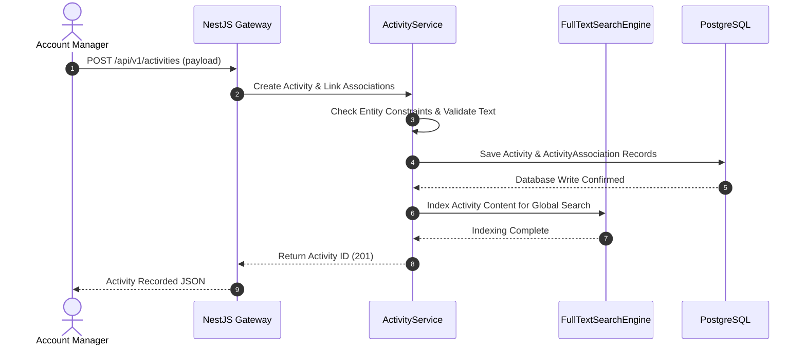

# Module 8: Activity Timeline & Interaction Hub

This document details the architecture, design, and implementation specifications for the Activity Timeline & Interaction Hub module of the Decent Global Outsourcing (DGO) CRM.

---

## 1. Problem Statement
Client engagement involves conversations scattered across multiple channels (Gmail, Outlook, Slack, phone calls, internal notes). Without a consolidated interaction hub, account executives and delivery leads lose operational context, lack a unified history of client communications, duplicate efforts, and fail to track engagement history during account handovers.

## 2. Objectives
- Centralize all user and client interactions (Emails, Calls, Notes, Meetings) into a single, unified timeline.
- Implement a polymorphic data model to associate activities seamlessly with Leads, Accounts, Contacts, or Opportunities.
- Enable email synchronization and automatic call logging via webhook integrations.
- Support real-time activity feed streaming using Server-Sent Events (SSE) or WebSockets.
- Enforce strict security validation to prevent unauthorized viewing of sensitive interaction logs.

## 3. Functional Requirements
- **Unified Timeline Feed**: A chronological stream of events related to a specific entity (Lead, Contact, Account, Opportunity).
- **Communication Loggers**: Forms to log calls (with status, notes, duration), schedule meetings, and post internal rich-text notes.
- **Email Ingestion**: Webhook handler to sync incoming/outgoing client emails from integrated GSuite/Office365 accounts.
- **Global Search**: Keyword-based full-text search across all timeline notes, email bodies, and meeting transcripts.
- **Activity Filter Matrix**: Toggle viewable interaction types (e.g., show only emails or only critical system audit logs).

## 4. Non-Functional Requirements
- **Performance**: Timeline loading must be optimized using database indexing, fetching 50 paginated records in < 150ms.
- **Scalability**: Support ingestion of 100,000 email records per day.
- **Storage**: Store large body contents (emails, meeting notes) efficiently using PostgreSQL compression and external S3 attachments.

## 5. Business Rules
- **BR1**: Internal Notes can be edited or deleted *only* by the user who created them, and only within 24 hours of posting.
- **BR2**: Emails synced from external clients cannot be modified or deleted, preserving communications integrity.
- **BR3**: An Activity must be associated with *at least one* CRM Entity (Lead, Contact, Account, or Opportunity). It is forbidden to have orphaned activities.
- **BR4**: Staff allocations, invoice dispatch events, and deal transitions (system events) are automatically posted to the timeline.

## 6. User Stories
- **US8.1**: *As a Sales Representative*, I want to open a Lead profile and see all past emails exchanged with them, so I don't repeat questions during follow-up calls.
- **US8.2**: *As a Project Manager*, I want to log a summary of a kickoff meeting on the Account timeline, so that delivery engineers understand the client's goals.
- **US8.3**: *As a Customer Success Manager*, I want to view a timeline of all billing status alerts alongside client emails, to understand their sentiment before a contract renewal.

## 7. Acceptance Criteria
- **AC1**: Database check constraint ensures exactly one or more entity links are valid and no orphaned activity exists.
- **AC2**: Next.js timeline renderer displays custom icons and colors for each activity type (e.g., blue for emails, green for calls, yellow for notes).
- **AC3**: Full-text search supports PostgreSQL `tsvector` queries across note contents.

## 8. UI Flow
```text
[CRM Entity Detail Workspace (e.g. Opportunity)]
                       │
                       ▼
            [Timeline Component] ──► (Loads Chronological List)
                       │
        ┌──────────────┼──────────────┐
        ▼              ▼              ▼
  [Write Note]    [Log Call]    [Filter Activities]
        │              │              │
        ▼              ▼              ▼
  [Save Draft]    [Saves Log]   [Redraws Feed]
```

## 9. Navigation
Timeline widgets are embedded inside core workspaces:
- `/dashboard/leads/:id`
- `/dashboard/accounts/:id`
- `/dashboard/opportunities/:id`
- `/dashboard/contacts/:id`

## 10. Wireframe Description
The Activity Timeline is rendered as a clean, vertical track:
- **Control Bar**: A tab strip allowing quick switches between "Add Note", "Log Call", "Email Client", "Schedule Event", and a search bar.
- **Vertical Line**: An interactive timeline line hosting circular event type icons.
- **Activity Cards**: Individual expanding boxes displaying:
  - Event title, creator name, timestamp.
  - Collapsed rich-text content (expandable to full text).
  - Quick action links (Edit note, reply to email, link attachment).

## 11. Database Schema
Below is the PostgreSQL schema represented in Prisma ORM format:

```prisma
model Activity {
  id             String         @id @default(dbgenerated("gen_random_uuid()")) @db.Uuid
  organizationId String         @db.Uuid
  userId         String?        @db.Uuid // Nullable for system generated events
  type           ActivityType
  title          String         @db.VarChar(255)
  content        String         @db.Text
  durationMinutes Int?          // Relevant for calls/meetings
  createdAt      DateTime       @default(now()) @db.Timestamptz(6)
  updatedAt      DateTime       @updatedAt @db.Timestamptz(6)

  organization   Organization   @relation(fields: [organizationId], references: [id])
  user           User?          @relation(fields: [userId], references: [id], onDelete: SetNull)
  associations   ActivityAssociation[]

  @@index([organizationId])
  @@index([createdAt(sort: Desc)])
}

enum ActivityType {
  NOTE
  EMAIL
  CALL
  MEETING
  SYSTEM_EVENT
}

model ActivityAssociation {
  id             String         @id @default(dbgenerated("gen_random_uuid()")) @db.Uuid
  activityId     String         @db.Uuid
  leadId         String?        @db.Uuid
  accountId      String?        @db.Uuid
  contactId      String?        @db.Uuid
  opportunityId  String?        @db.Uuid

  activity       Activity       @relation(fields: [activityId], references: [id], onDelete: Cascade)

  @@index([activityId])
  @@index([leadId])
  @@index([accountId])
  @@index([contactId])
  @@index([opportunityId])
}
```

## 12. Relationships
- **Activity to ActivityAssociation**: One-to-Many. Since an activity can link to multiple entities (e.g. an email sent to a Contact about a specific Opportunity under an Account), associations are normalized into `ActivityAssociation`.
- **User to Activity**: One-to-Many. Represents the author of the note, meeting logger, or sender of the email.

## 13. Validation Rules
- `type`: Must match defined enum criteria.
- `durationMinutes`: Must be positive if provided.
- `associations`: Validation logic requires at least one foreign key (`leadId`, `accountId`, `contactId`, or `opportunityId`) in `ActivityAssociation` to be defined.

## 14. API Endpoints
- `GET /api/v1/activities`: Returns a paginated list of activities (requires query params specifying `entityType` and `entityId`).
- `POST /api/v1/activities`: Inserts manually created notes or logs calls.
- `POST /api/v1/activities/email-webhook`: Ingests emails from external mail client hooks.
- `DELETE /api/v1/activities/:id`: Deletes internal notes (enforces 24h business logic limits).

## 15. Request/Response Examples

### POST `/api/v1/activities`
**Request Payload:**
```json
{
  "type": "CALL",
  "title": "Outbound Call to ACME CTO",
  "content": "Discussed proposed Java Developer profiles. John requested scheduling a coding interview next Tuesday.",
  "durationMinutes": 15,
  "associations": {
    "accountId": "68bfd88e-4a6c-4861-8ff6-3245bc98df12",
    "contactId": "1bcd3342-9988-4dbf-8199-ab89004d4bed",
    "opportunityId": "77ccaa89-2287-43eb-8e99-dbad4f18bc55"
  }
}
```

**Response Payload (Status 201 Created):**
```json
{
  "success": true,
  "activityId": "aaee1122-33cc-44dd-55ee-66ff778899aa",
  "createdAt": "2026-07-15T16:24:00Z"
}
```

## 16. Error Responses

### 403 Forbidden (Modification past expiration)
```json
{
  "statusCode": 403,
  "message": "Notes cannot be edited or deleted after 24 hours of creation.",
  "error": "Forbidden",
  "timestamp": "2026-07-15T16:25:00.000Z"
}
```

## 17. Permissions
- `activities:read`: Search and read interactions on permitted entities.
- `activities:write`: Log calls, meetings, write notes, and post updates.
- `activities:delete`: Restrict deletion privileges for notes.

## 18. Notifications
- **Mention Notification**: Email alert dispatched when a user tags another colleague using `@Username` syntax in notes.
- **Client Email Alert**: Workspace banner updates when a client sends a reply related to an active Opportunity.

## 19. Audit Logs
- **Event**: `Activity.NoteDeleted`
  - *Data*: `{ "activityId": "aaee1122...", "deletedBy": "user-uuid" }`
- **Event**: `Activity.EmailSynced`
  - *Data*: `{ "messageId": "msg-123...", "recipient": "contact@client.com" }`

## 20. Activity Timeline
- *July 15, 2026 16:23* - **Call Logged**: Rep spent 15 mins reviewing profile targets.
- *July 15, 2026 16:24* - **System Event**: Proposal invoice #INV-2026-0001 dispatched (Status: Sent).
- *July 15, 2026 16:25* - **Email Received**: Sync daemon matched response email from John Doe.

## 21. Sequence Diagram


## 22. Edge Cases
- **Activity with Multiple Target Associations**: If an activity links to two contacts belonging to different organizations, multi-tenant checks prevent database insertion, ensuring billing isolation parameters remain clean.
- **Search SQL Injection on Full Text Query**: Managed by using parameterized custom query inputs inside PostgreSQL text match filters.

## 23. Future Improvements
- **Automatic Transcription Service**: Integration with Twilio/Zoom APIs to record calls and automatically post clean summary transcripts to the CRM timeline.
- **NLP Sentiment Analysis**: Use language modeling tools to analyze email threads and flag "At Risk" accounts where interactions express low client sentiment scores.
